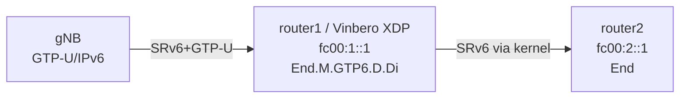

# GTP-U Drop-In mode

*(日本語: [README.ja.md](./README.ja.md))*

Demo environment for the RFC 9433 Drop-In mode, which introduces SRv6 into an
existing GTP-U deployment with minimal change.

## Overview

Vinbero's End.M.GTP6.D.Di is a SID-triggered endpoint that recognises GTP-U
carried inside an SRv6 packet. In Drop-In mode it:

- does **not** decrement SL or update the DA
- passes the packet to the kernel's SRv6 stack with `XDP_PASS`, **without
  rewriting a single byte**

Rewriting only the nexthdr while the GTP-U bytes stay in place would produce
an inconsistent packet, so Vinbero deliberately hands it over untouched. That
keeps the existing GTP-U forwarding infrastructure essentially as-is while
integrating it with an SRv6 domain.

## Topology


```mermaid
graph LR
    gNB[gNB<br/>GTP-U/IPv6] -->|SRv6+GTP-U| router1[router1 / Vinbero XDP<br/>fc00:1::1<br/>End.M.GTP6.D.Di]
    router1 -->|SRv6 via kernel| router2[router2<br/>fc00:2::1<br/>End]
```

## Quick start

```bash
sudo ./setup.sh
sudo ./test.sh
sudo ./teardown.sh
```

## How it behaves

1. The packet arrives as `[IPv6][SRH(nexthdr=UDP)][UDP:2152][GTP-U][Inner IP]`
2. Vinbero XDP verifies that the SRH nexthdr is UDP and that the GTP-U header
   is well formed
3. The packet is handed to the kernel with `XDP_PASS`, unmodified (SL, DA and
   nexthdr are all unchanged)
4. The kernel SRv6 stack takes it from there

Since nothing is converted, `test.sh` uses the per-slot invocation counter
(`vinbero stats slot show`) to confirm that the Di program actually ran for
those packets. The client binary in the netns examples is `vinbero`; there is
no `out/bin/vbctl` (that name is a symlink inside the interop-clab Docker
image).
