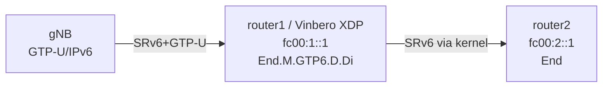

# SRv6 GTP-U/IPv6 Drop-In (End.M.GTP6.D.Di)

RFC 9433のDrop-Inモード: 既存のGTP-Uインフラに最小限の変更でSRv6を導入するデモ環境です。

## 概要

Vinbero の End.M.GTP6.D.Di は SRv6 パケットの中に載った GTP-U を認識する SID-triggered endpoint です。Drop-In モードでは:
- SL の減算も DA の更新も**行わない**
- パケットを**一切書き換えず** `XDP_PASS` でカーネルの SRv6 スタックに委譲する

GTP-U のバイトが残ったまま nexthdr だけ書き換えると不整合なパケットになるため、Vinbero は意図的に無改変で渡します。これにより既存の GTP-U 転送インフラをほぼそのまま維持しつつ SRv6 ドメインと統合できます。

## トポロジー


```mermaid
graph LR
    gNB[gNB<br/>GTP-U/IPv6] -->|SRv6+GTP-U| router1[router1 / Vinbero XDP<br/>fc00:1::1<br/>End.M.GTP6.D.Di]
    router1 -->|SRv6 via kernel| router2[router2<br/>fc00:2::1<br/>End]
```

## クイックスタート

```bash
sudo ./setup.sh
sudo ./test.sh
sudo ./teardown.sh
```

## 動作

1. パケット受信: `[IPv6][SRH(nexthdr=UDP)][UDP:2152][GTP-U][Inner IP]`
2. Vinbero XDP: SRH nexthdr が UDP かつ GTP-U が妥当であることを検証
3. パケットを書き換えずに `XDP_PASS` でカーネルに委譲 (SL/DA/nexthdr は不変)
4. カーネル SRv6 スタックがそのまま処理

変換が無いため、`test.sh` は per-slot 呼び出しカウンタ (`vinbero stats slot show`) で Di プログラムが当該パケットに対して実行されたことを確認します。netns example のクライアントバイナリは `vinbero` です (`out/bin/vbctl` はありません。`vbctl` は interop-clab の Docker image 内の symlink です)。
