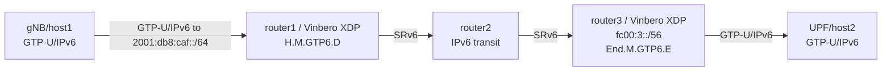

# SRv6 GTP-U/IPv6 (H.M.GTP6.D + End.M.GTP6.E)

*(English: [README.md](./README.md))*

RFC 9433 に基づく GTP-U/IPv6 と SRv6 の変換デモ環境です。gtp4-encap の IPv6 対称版で、router1 は素の GTP-U/IPv6 tunnel を outer IPv6 dst で intercept して SRv6 化する headend (H.M.GTP6.D) として動きます。

## トポロジー



**パケットの流れ:**
1. gNB が素の GTP-U/IPv6 パケットを N3/UPF アドレス (2001:db8:caf::/64) 宛に送信。router1 経由でルーティングされる
2. **router1 (H.M.GTP6.D)**: outer IPv6 dst で GTP-U tunnel を intercept し、外側 IPv6+UDP+GTP-U を剥離して End.M.GTP6.E SID 向けに SRv6 encap。TEID/QFI を SID の Args.Mob.Session (args_offset 8) に encode
3. router2: SRv6 を素の IPv6 として transit (localsid なし)
4. **router3 (End.M.GTP6.E)**: SRv6 を剥離、SID から TEID/QFI を decode して GTP-U/IPv6 で再カプセル化

args_offset を 8 にすることで Args.Mob.Session の 5 バイトが /64 locator の外 (byte 8-12) に入り、SID が経路可能なまま保たれます。

## クイックスタート

```bash
sudo ./setup.sh
sudo ./test.sh
sudo ./teardown.sh
```

`test.sh` は router1 で H.M.GTP6.D を登録 (`hv6 create --mode H_M_GTP6_D --args-offset 8`)、host1 から素の GTP-U/IPv6 を送り、router1→router2 リンクで変換後の SRv6 パケットを捕捉して変換を検証します。
