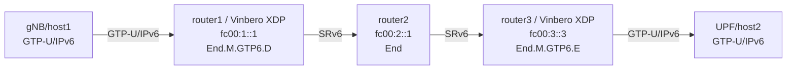

# SRv6 GTP-U/IPv6 (End.M.GTP6.D + End.M.GTP6.E)

RFC 9433に基づくGTP-U/IPv6とSRv6の双方向変換のデモ環境です。

## トポロジー



**パケットの流れ:**
1. gNBがGTP-U/IPv6パケットをSRv6パス上で送信
2. **router1 (End.M.GTP6.D)**: GTP-Uを剥離、SRv6セグメント処理を継続。TEID/QFIを次SIDのArgs.Mob.Sessionにエンコード
3. router2 (End): SRv6 transit
4. **router3 (End.M.GTP6.E)**: SRv6を剥離、SIDからTEID/QFIをデコード、GTP-U/IPv6で再カプセル化

## クイックスタート

```bash
sudo ./setup.sh
sudo ./test.sh
sudo ./teardown.sh
```
