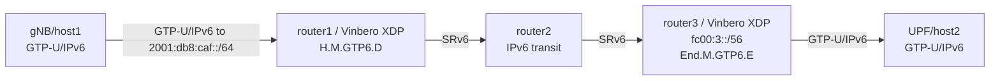

# GTP-U/IPv6 and SRv6 conversion

*(日本語: [README.ja.md](./README.ja.md))*

Demo environment for converting between GTP-U/IPv6 and SRv6 per RFC 9433.
This is the IPv6 counterpart of gtp4-encap: router1 acts as the headend
(H.M.GTP6.D) that intercepts a plain GTP-U/IPv6 tunnel by its outer IPv6
destination and turns it into SRv6.

## Topology


```mermaid
graph LR
    gNB[gNB/host1<br/>GTP-U/IPv6] -->|GTP-U/IPv6 to 2001:db8:caf::/64| router1[router1 / Vinbero XDP<br/>H.M.GTP6.D]
    router1 -->|SRv6| router2[router2<br/>IPv6 transit]
    router2 -->|SRv6| router3[router3 / Vinbero XDP<br/>fc00:3::/56<br/>End.M.GTP6.E]
    router3 -->|GTP-U/IPv6| UPF[UPF/host2<br/>GTP-U/IPv6]
```

**Packet walk:**
1. gNB sends a plain GTP-U/IPv6 packet towards the N3/UPF address
   (2001:db8:caf::/64), which routes through router1
2. **router1 (H.M.GTP6.D)** intercepts the GTP-U tunnel by its outer IPv6
   destination, strips the outer IPv6 + UDP + GTP-U, and encapsulates towards
   the End.M.GTP6.E SID. TEID and QFI are encoded into the SID's
   Args.Mob.Session (args_offset 8)
3. router2 transits the SRv6 packet as plain IPv6 (no localsid)
4. **router3 (End.M.GTP6.E)** strips SRv6, decodes TEID and QFI from the SID,
   and re-encapsulates as GTP-U/IPv6

With args_offset 8 the five Args.Mob.Session bytes land outside the /64
locator (bytes 8-12), so the SID stays routable.

## Quick start

```bash
sudo ./setup.sh
sudo ./test.sh
sudo ./teardown.sh
```

`test.sh` registers H.M.GTP6.D on router1 (`hv6 create --mode H_M_GTP6_D
--args-offset 8`), sends a plain GTP-U/IPv6 packet from host1, and captures
the converted SRv6 packet on the router1-router2 link to verify the
conversion.
