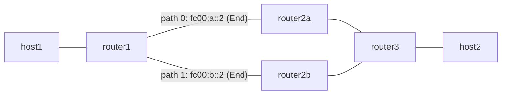

# headend-ecmp — Headend ECMP path group と liveness fast reroute

*(English: [README.md](./README.md))*

headend の ECMP path group データプレーンを実演します。1 つの HeadendV4 trigger prefix を per-flow の weighted hash で 2 本の SRv6 path に分散し、liveness bitmap への 1 word の書き込みだけで、group 定義に触れずに全フローを生存 path へ切り替えます。

設計は [`docs/design/ja/ecmp.md`](../../docs/design/ja/ecmp.md) を参照してください。

## トポロジ



- `router1` は Vinbero (XDP H.Encaps) を実行します。trigger prefix `172.0.2.0/24` が等重みの 2 path を持つ ECMP group 1 を参照します。
- `router2a` / `router2b` は Linux ネイティブの SRv6 transit ノード (`End`) です。
- `router3` は `End.DX4` で `host2` へ終端します。
- 復路 (`host2` → `host1`) は `router2a` 経由の Linux ネイティブ encap 1 本です。

## テストで検証する内容

1. ベースライン: path A 経由の Linux ネイティブ encap が end-to-end で通ること。
2. Vinbero 単一 path: 従来どおりの HeadendV4 エントリ (group_id 0) が変わらず動くこと。
3. ECMP 分散: source port が異なる 100 本の UDP flow が両 path に分かれること。transit ルータのインタフェースカウンタで測定します。
4. fast reroute: liveness bitmap に `0x2` を書く (path 0 down) と全フローが path B へ移り、エントリを消すと fail-open で分散が戻ること。

## group の設定方法

ECMP group の本来の書き手は BGP applier で、operator 向け RPC はまだ無いため、この example では `vinbero-ecmpdemo` を使います。`make build` で `out/bin/` にビルドされるデモ用ツールで、daemon の map file descriptor 経由で group テーブルを書きます。

```bash
# trigger エントリから mode/src を引き継いで 2 path の group を作る
vinbero-ecmpdemo group-put --pid <vinberod-pid> --group-id 1 \
  --from-trigger 172.0.2.0/24 \
  --path "fc00:a::2+fc00:3::3@1" \
  --path "fc00:b::2+fc00:3::3@1"

# trigger エントリを group に向ける
vinbero-ecmpdemo attach --pid <vinberod-pid> --trigger 172.0.2.0/24 --group-id 1

# path 0 を down にする / 復旧する
vinbero-ecmpdemo live-set --pid <vinberod-pid> --group-id 1 --bitmap 0x2
vinbero-ecmpdemo live-clear --pid <vinberod-pid> --group-id 1
```

## 実行方法

```bash
sudo ./setup.sh
sudo ./test.sh
sudo ./teardown.sh
```
