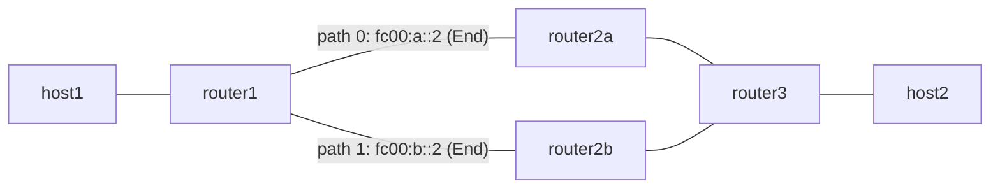

# headend-ecmp — Headend ECMP path group + liveness fast reroute

*(日本語: [README.ja.md](./README.ja.md))*

Demonstrates the headend ECMP path group data plane: one HeadendV4 trigger
prefix fans out over two SRv6 paths by per-flow weighted hashing, and a
one-word write to the liveness bitmap reroutes every flow to the surviving
path without touching the group definition.

See [`docs/design/ja/ecmp.md`](../../docs/design/ja/ecmp.md) for the design.

## Topology



- `router1` runs Vinbero (XDP H.Encaps). The trigger prefix `172.0.2.0/24`
  references ECMP group 1 with two equal-weight paths.
- `router2a` / `router2b` are plain Linux SRv6 transit nodes (`End`).
- `router3` terminates with `End.DX4` towards `host2`.
- The return path (`host2` → `host1`) is a single Linux native encap via
  `router2a`.

## What the test verifies

1. Baseline: Linux native encap over path A works end-to-end.
2. Vinbero single path: a plain HeadendV4 entry (group_id 0) still behaves
   as before.
3. ECMP spread: 100 UDP flows (distinct source ports) split across both
   paths, measured by the transit routers' interface counters.
4. Fast reroute: writing liveness bitmap `0x2` (path 0 down) moves all
   flows to path B; clearing the entry fails open and restores the spread.

## Configuring the group

The BGP applier is the intended writer of ECMP groups and no operator RPC
exists yet, so this example uses `vinbero-ecmpdemo` (built by `make build`
into `out/bin/`), a demo tool that writes the daemon's group tables through
its map file descriptors:

```bash
# Install a 2-path group, cloning mode/src from the trigger entry
vinbero-ecmpdemo group-put --pid <vinberod-pid> --group-id 1 \
  --from-trigger 172.0.2.0/24 \
  --path "fc00:a::2+fc00:3::3@1" \
  --path "fc00:b::2+fc00:3::3@1"

# Point the trigger entry at the group
vinbero-ecmpdemo attach --pid <vinberod-pid> --trigger 172.0.2.0/24 --group-id 1

# Mark path 0 down / recover
vinbero-ecmpdemo live-set --pid <vinberod-pid> --group-id 1 --bitmap 0x2
vinbero-ecmpdemo live-clear --pid <vinberod-pid> --group-id 1
```

## Run

```bash
sudo ./setup.sh
sudo ./test.sh
sudo ./teardown.sh
```
