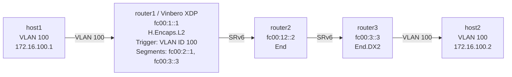

# SRv6 H.Encaps.L2 Playground

*(日本語: [README.ja.md](./README.ja.md))*

Demo environment for SRv6 H.Encaps.L2 (headend L2 encapsulation) for L2VPN on
Vinbero XDP.

## Overview

H.Encaps.L2 encapsulates a whole L2 frame, Ethernet header included, into an
SRv6 packet. That gives an L2VPN which extends an L2 domain across an SRv6
network.

**Trigger**: VLAN ID (a VLAN-tagged packet, or VLAN ID 0 for untagged)

## Topology



**Packet walk (host1 to host2):**
1. host1 sends a VLAN 100 tagged frame (172.16.100.1 to 172.16.100.2)
2. **router1 (Vinbero XDP)** runs H.Encaps.L2:
   - encapsulates the whole L2 frame in IPv6 + SRH
   - next header: IPPROTO_ETHERNET (143)
   - outer DA: fc00:2::1 (the first segment)
   - segment list: [fc00:2::1, fc00:3::3]
3. router2 runs End on fc00:2::1: decrement SL, move to the next segment
4. router3 runs End.DX2 on fc00:3::3 and restores the L2 frame
5. host2 receives the frame

## Quick start

```bash
sudo ./setup.sh    # build the environment
sudo ./test.sh     # run the tests
sudo ./teardown.sh # clean up
```

## Running it by hand

### 1. Build the environment and start Vinbero

```bash
sudo ./setup.sh

# Start Vinbero
sudo ip netns exec hl2-router1 ../../out/bin/vinberod -c vinbero_router1.yaml
```

### 2. Register the HeadendL2 entry

```bash
sudo ip netns exec hl2-router1 ../../out/bin/vinbero -s http://127.0.0.1:8082 hl2 create --vlan-id 100 --src-addr fc00:1::1 --segments fc00:2::1,fc00:3::3
```

### 3. Test

```bash
# ping over VLAN 100
sudo ip netns exec hl2-host1 ping -c 3 -I hl2-h1rt1.100 172.16.100.2
```

### 4. Confirm with a packet capture

```bash
# SRv6 packets between router1 and router2
sudo ip netns exec hl2-router2 tcpdump -i hl2-rt2rt1 -n -v ip6
```

The capture shows the SRv6 Routing Header (RT6) and next header 143
(Ethernet).

### 5. Clean up

```bash
sudo ./teardown.sh
```

## L2VPN use cases

H.Encaps.L2 fits L2VPN scenarios such as:

- **VLAN extension**: connect a VLAN transparently across sites
- **L2 bridging**: extend an Ethernet segment between remote sites
- **Legacy support**: connect applications that cannot use an L3 service

## Details

### SRv6 header layout

```
+------------------+
| Outer IPv6 Header|
| (SA: fc00:1::1)  |
| (DA: fc00:2::1)  |
+------------------+
| Segment Routing  |
| Header (SRH)     |
| Segments Left: 1 |
| [fc00:2::1,      |
|  fc00:3::3]      |
| Next Header: 143 |
+------------------+
| Original L2 Frame|
| (Ethernet Header)|
| (VLAN 100 Tag)   |
| (IP Payload)     |
+------------------+
```

### End.DX2 behavior

End.DX2 extracts the L2 frame from the SRv6 packet and forwards it out the
configured interface:

```bash
# End.DX2 on Linux
ip -6 route add local fc00:3::3/128 encap seg6local action End.DX2 oif eth1
```
