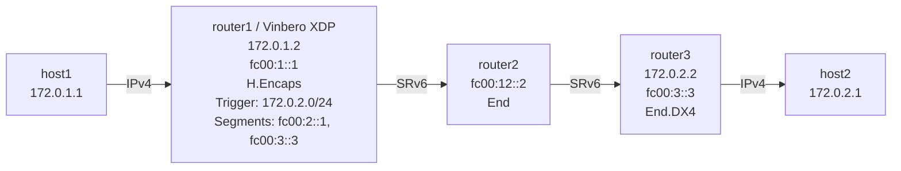

# SRv6 Headend (H.Encaps) IPv4 Playground

Vinbero XDPによるSRv6 H.Encaps (Headend Encapsulation) for IPv4のデモ環境です。

## トポロジー



**パケットの流れ（host1→host2の例）:**
1. host1が172.0.2.1にpingを送信 (IPv4)
2. **router1 (Vinbero XDP)** がH.Encapsを実行:
   - IPv4パケットをIPv6+SRHでカプセル化
   - Outer DA: fc00:2::1 (最初のセグメント)
   - Segment List: [fc00:2::1, fc00:3::3]
3. router2がfc00:2::1でEnd操作を実行（SL減少、次のセグメントへ）
4. router3がfc00:3::3でEnd.DX4を実行（IPv4に戻す）
5. host2がpingを受信

## クイックスタート

```bash
sudo ./setup.sh    # 環境構築
sudo ./test.sh     # テスト実行
sudo ./teardown.sh # クリーンアップ（環境削除）
```

## 手動実行

### 1. 環境構築とVinbero起動

```bash
sudo ./setup.sh

# router1のLinux native SRv6ルートを削除
sudo ip netns exec hv4-router1 ip route del 172.0.2.0/24 2>/dev/null

# Vinbero起動
sudo ip netns exec hv4-router1 ../../out/bin/vinberod -c vinbero_router1.yaml
```

### 2. HeadendV4エントリ登録

```bash
sudo ip netns exec hv4-router1 ../../out/bin/vinbero -s http://127.0.0.1:8082 hv4 create --trigger-prefix 172.0.2.0/24 --src-addr fc00:1::1 --segments fc00:2::1,fc00:3::3
```

### 3. テスト

```bash
sudo ip netns exec hv4-host1 ping -c 3 172.0.2.1
```

#### パケットキャプチャ

```bash
# router1-router2間でSRv6パケットを確認
sudo ip netns exec hv4-router2 tcpdump -i hv4-rt2rt1 -n ip6
```

SRv6 Routing Header (RT6) でsegment list: [fc00:2::1, fc00:3::3] が確認できます。

### 4. 環境のクリーンナップ
```bash
sudo ./teardown.sh
```
