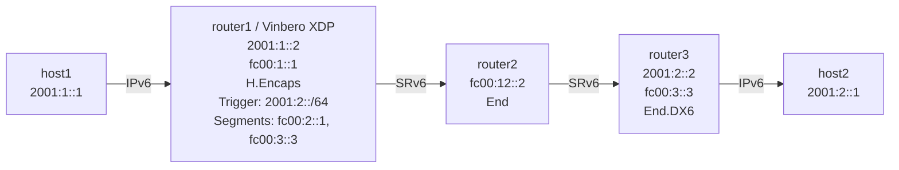

# SRv6 H.Encaps for IPv6 Playground

*(日本語: [README.ja.md](./README.ja.md))*

Demo environment for SRv6 H.Encaps (headend encapsulation) of IPv6 traffic on
Vinbero XDP. The IPv6 packet is encapsulated in IPv6 + SRH (IPv6-in-IPv6).

## Topology



**Packet walk (host1 to host2):**
1. host1 pings 2001:2::1 over IPv6
2. **router1 (Vinbero XDP)** runs H.Encaps:
   - encapsulates the IPv6 packet in an outer IPv6 + SRH
   - outer DA: fc00:2::1 (the first segment)
   - segment list: [fc00:2::1, fc00:3::3]
3. router2 runs End on fc00:2::1: decrement SL, move to the next segment
4. router3 runs End.DX6 on fc00:3::3 and extracts the inner IPv6 packet
5. host2 receives the ping

## Quick start

```bash
sudo ./setup.sh    # build the environment
sudo ./test.sh     # run the tests
sudo ./teardown.sh # clean up
```

## Running it by hand

### 1. Build the environment and start Vinbero

```bash
sudo ./setup.sh

# Remove the Linux native SRv6 route on router1
sudo ip netns exec hv6-router1 ip -6 route del 2001:2::/64 2>/dev/null

# Start Vinbero
sudo ip netns exec hv6-router1 ../../out/bin/vinberod -c vinbero_router1.yaml
```

### 2. Register the HeadendV6 entry

```bash
sudo ip netns exec hv6-router1 ../../out/bin/vinbero -s http://127.0.0.1:8082 hv6 create --trigger-prefix 2001:2::/64 --src-addr fc00:1::1 --segments fc00:2::1,fc00:3::3
```

### 3. Test

```bash
sudo ip netns exec hv6-host1 ping6 -c 3 2001:2::1
```

#### Packet capture

```bash
# SRv6 packets between router1 and router2
sudo ip netns exec hv6-router2 tcpdump -i hv6-rt2rt1 -n ip6
```

The capture shows the inner IPv6 packet encapsulated inside the outer
IPv6 + SRH.

### 4. Clean up

```bash
sudo ./teardown.sh
```
