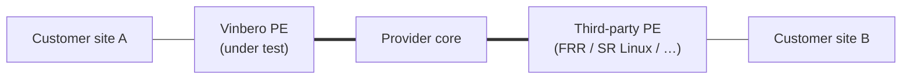

# Vinbero interop labs (containerlab)

An **interop test library**: each lab peers **Vinbero** against an
**independent, third-party routing implementation** and asserts that
they interoperate on the wire — both the control plane (BGP / RFC 9252
SRv6 Service TLVs) and the data plane (real traffic over SRv6).

Vinbero is always the implementation **under test**. The peer is
whatever independent implementation best exercises the feature a given
scenario targets — **FRRouting** today, **SR Linux** or others as
future scenarios need a peer that supports a feature FRR lacks. The peer
is therefore scoped to a *scenario*, never to the lab as a whole.



Each scenario is self-contained under `scenarios/<name>/` and is driven
through the shared `Makefile` with the `SCENARIO` variable.

## Scenarios

| Scenario       | Peer       | What it proves                                                                 |
|----------------|------------|--------------------------------------------------------------------------------|
| `l3vpn-2site`  | FRR 10.2.1 | 2-site SRv6 L3VPN — VPNv4/VPNv6 Service TLV encode+decode (RFC 9252 §4 transposition) and a bidirectional SRv6 data-plane ping. See [`scenarios/l3vpn-2site/README.md`](scenarios/l3vpn-2site/README.md). |

## Layout

```
examples/interop-clab/
├── README.md                 # this file — overview + scenario index
├── Makefile                  # build shared images; deploy/test/destroy a scenario
├── images/                   # shared container images, one subdir per implementation
│   ├── vinbero/Dockerfile     # vinberod + vbctl runtime image
│   └── frr/                   # FRR peer image
│       ├── Dockerfile
│       └── daemons
└── scenarios/
    └── l3vpn-2site/           # scenario #1
        ├── README.md          # this scenario's detailed doc
        ├── clab.yml           # containerlab topology
        ├── test.sh            # scenario assertions
        ├── core/start.sh
        ├── frr/{frr.conf,start.sh}
        └── vinbero/{vinbero.yml,start.sh}
```

`images/` is per-implementation so a future `images/srlinux/` slots in
naturally. The shared images are built once and reused by every
scenario.

## Prerequisites

* Docker
* [containerlab](https://containerlab.dev/install/)
* `sudo` (containerlab needs it)
* `python3` (scenarios may parse router JSON output)

The Vinbero runtime image is built straight from the repo — the BPF
objects are committed under `pkg/bpf/` and embedded via `go:embed`, so
no `make bpf-gen` is required.

## Run

```bash
make build                       # build the shared container images
make deploy                      # bring the default scenario up
make test                        # run the scenario's assertions
make destroy                     # tear it down

make all                         # build + deploy + test + destroy
make all SCENARIO=l3vpn-2site     # pick a scenario explicitly
```

`SCENARIO` defaults to `l3vpn-2site`. Other targets:

| Target           | Effect                                                       |
|------------------|--------------------------------------------------------------|
| `make scenarios` | List the available scenarios under `scenarios/`.             |
| `make status`    | Dump BGP / headend state for the selected scenario.          |
| `make logs`      | Dump the daemon logs for the selected scenario.              |
| `make reload`    | `destroy` then `deploy` the selected scenario.               |

Containers are named `clab-<scenario>-<node>` (e.g.
`clab-l3vpn-2site-pe-tokyo`).

## How to add a scenario

1. Create `scenarios/<name>/` with at least a `clab.yml` and a
   `test.sh`.
2. Set the topology's `name:` to the scenario name (`name: <name>`) so
   its containers are `clab-<name>-<node>` and do not collide with other
   scenarios. Reference the container names that way in `test.sh`.
3. Reuse the shared images from `images/` where possible. If the
   scenario needs a peer implementation that does not yet have an image,
   add `images/<impl>/` and a matching `build-<impl>` target to the
   `Makefile`.
4. Keep `clab.yml` `binds:` relative to the `clab.yml` file — bind
   sources like `vinbero/start.sh` resolve against `scenarios/<name>/`.
5. Make `test.sh` self-contained: it should gate on readiness rather
   than sleep, and exit non-zero on the first failed assertion.
6. Add a row to the scenario index table above and a
   `scenarios/<name>/README.md` describing the scenario.

Run it with `make all SCENARIO=<name>`.
