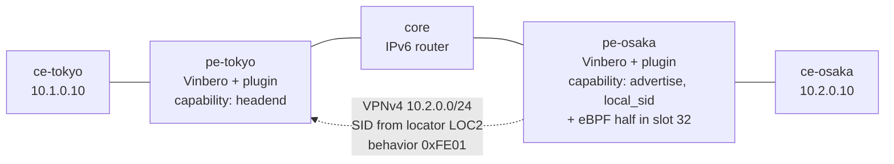

# cplane-plugin-2site

An operator's own SRv6 endpoint behavior, carried over BGP between two
nodes and turned into forwarding by a control-plane plugin.



## What it proves

The plugin mechanism exists so an operator can define a behavior of their
own and have it work end to end without waiting for a codepoint to be
standardized or for vinbero to implement it. This scenario is that claim,
run on two real nodes.

pe-osaka's plugin asks the daemon for a SID out of locator `LOC2` pointing
at its own eBPF slot, is handed an address, and originates `10.2.0.0/24`
behind it with its own behavior codepoint `0xFE01` in the SID TLV. Nothing
in vinbero or in BGP knows what `0xFE01` means, and nothing in the config
names the address: the daemon picked it.

pe-tokyo's plugin claims that codepoint, which withholds the route from
vinbero's own appliers -- they read a service SID without consulting its
behavior, so an unrecognized one would be installed with the wrong meaning
and then collide with the plugin's own write. The plugin reads the route
instead and declares the headend entry.

So the forwarding state for `10.2.0.0/24` on pe-tokyo exists only because
a plugin put it there, and the test pings through it.

Neither plugin is granted more than it needs. pe-tokyo's has `headend`
alone and cannot originate a route; pe-osaka's has `advertise` and
`local_sid` and cannot write forwarding state -- not as a check they might
get past, but because the host functions for what they were not granted
are never linked into their modules.

Each is also given a scope, which says where that capability may be
exercised. pe-tokyo's plugin may install headend entries only inside
10.2.0.0/16, so it cannot write a longer prefix over traffic this node
already forwards -- the headend maps are keyed on the destination alone, so
that would win on longest match without ever touching the entry it shadows.
pe-osaka's plugin may originate only into `vrf-cust`, allocate only from
`LOC2`, and point a SID only at slot 32. The route distinguisher and route
targets come from the VRF's binding rather than from the plugin, because
the route targets are what decide which VRF a peer imports the route into,
and the slot is bounded because a SID aimed at another plugin's slot would
have that plugin read these aux bytes under a layout that does not
describe them.

## Why both ends are Vinbero

Every other scenario here peers vinbero against an independent
implementation. This one cannot: the behavior under test is one no
standard assigns and no other implementation knows. A plugin has to be
present at both ends of the conversation it is having, which is the point
of the mechanism rather than a limitation of the lab.

The return direction (`ce-osaka -> ce-tokyo`) is an ordinary L3VPN route
with no plugin involved, so a failure in one direction points at the
plugin and a failure in both points at the lab.

## The SID behind the advertisement

pe-osaka's plugin ships both halves. Its eBPF half
(`sdk/examples/plugin-custom-behavior`) is registered into endpoint slot
32, and its control-plane half asks for a local SID pointing at that slot.
The operator provisions no SID at all: the address on the wire is one the
daemon allocated out of `LOC2` in response to the plugin's declaration.

That is what closes the loop. The steering side proves the codepoint moves
an operator's meaning across BGP; the endpoint side proves the address it
resolves to belongs to the plugin and lands in the plugin's own program.
Neither half is a behavior vinbero implements, so a break in SID
allocation, in the scope that bounds it, or in dispatch to a plugin's slot
shows up here as a customer ping that does not complete.

The eBPF half hands the packet to vinbero's `End.DT4` to finish the decap.
A plugin cannot call `bpf_redirect` -- packet-level redirects go through
the epilogue or a vinbero PROG_ARRAY -- so tail-calling into a validated
slot is how a plugin completes a packet's journey, not a shortcut around
writing one. The per-slot invocation counter is what the test reads to
show the packets really went through slot 32.

The decap is VRF-scoped. Because the SID is a plugin slot, the aux
discriminator nulls the aux the built-in `End.DT4` would read (the B4
boundary), so `End.DT4` cannot take a VRF ifindex from the plugin's own
aux. The plugin's local-SID declaration names a `decap_vrf` instead, and
the host records the VRF's ifindex in a grant it owns and the plugin cannot
write; `End.DT4` reads the VRF from there. Here that VRF is `vrf-cust`, and
pe-osaka's customer interface is enslaved to it, so ce-osaka's subnet is a
connected route in the VRF's table and absent from the main table. A decap
that fell back to the main table -- what a plugin handoff did before the
grant existed -- would find nothing and drop. The test asserts that split
directly, so the customer ping completing proves the grant is what carried
the traffic into the VRF.

## Run

```sh
make all SCENARIO=cplane-plugin-2site
```

The WebAssembly half is `sdk/examples/cplane-custom-behavior/plugin.wasm`,
bound into both PEs, so the lab runs exactly what `make cplane-example`
produces. Rebuild it with TinyGo after changing the example.

The eBPF half is compiled by the scenario's `build.sh`, which `make build`
runs. It is built rather than committed because the object depends on the
SDK headers it was compiled against, and a stale one fails the
`MapReplacements` compatibility check at registration with nothing saying
why.

## What the test checks

1. both plugins are registered, with the capabilities they were granted;
2. pe-osaka applied the advertisement its plugin declared;
3. pe-tokyo's headend map holds `10.2.0.0/24` steering into the advertised
   SID, and the daemon log attributes it to the plugin's declared set;
4. pe-osaka installed a dispatch entry for that SID pointing at endpoint
   slot 32, and the plugin's eBPF half occupies it;
5. a real `ping` from ce-tokyo reaches ce-osaka through it, decapsulating
   into `vrf-cust` (whose table holds ce-osaka's subnet while the main table
   does not), and slot 32's invocation counter shows the packets went
   through the plugin's program;
6. unregistering the plugin takes its entry with it.
