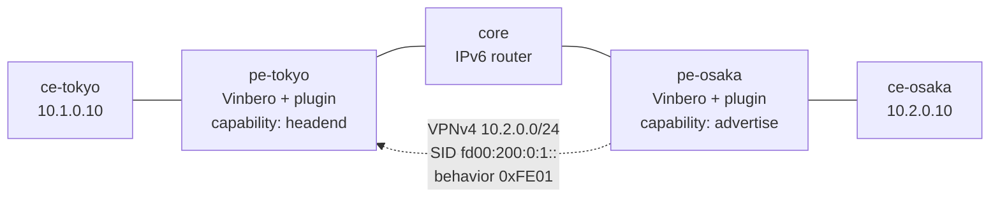

# cplane-plugin-2site

An operator's own SRv6 endpoint behavior, carried over BGP between two
nodes and turned into forwarding by a control-plane plugin.



## What it proves

The plugin mechanism exists so an operator can define a behavior of their
own and have it work end to end without waiting for a codepoint to be
standardized or for vinbero to implement it. This scenario is that claim,
run on two real nodes.

pe-osaka's plugin originates `10.2.0.0/24` with the SID `fd00:200:0:1::`
and its own behavior codepoint `0xFE01` in the SID TLV. Nothing in vinbero
or in BGP knows what `0xFE01` means.

pe-tokyo's plugin claims that codepoint, which withholds the route from
vinbero's own appliers -- they read a service SID without consulting its
behavior, so an unrecognized one would be installed with the wrong meaning
and then collide with the plugin's own write. The plugin reads the route
instead and declares the headend entry.

So the forwarding state for `10.2.0.0/24` on pe-tokyo exists only because
a plugin put it there, and the test pings through it.

Each plugin is granted exactly one capability. pe-tokyo's cannot originate
a route and pe-osaka's cannot write forwarding state -- not as a check
they might get past, but because the host functions for what they were not
granted are never linked into their modules.

## Why both ends are Vinbero

Every other scenario here peers vinbero against an independent
implementation. This one cannot: the behavior under test is one no
standard assigns and no other implementation knows. A plugin has to be
present at both ends of the conversation it is having, which is the point
of the mechanism rather than a limitation of the lab.

The return direction (`ce-osaka -> ce-tokyo`) is an ordinary L3VPN route
with no plugin involved, so a failure in one direction points at the
plugin and a failure in both points at the lab.

## The SID behind the advertisement

pe-osaka's advertised SID is an ordinary `End.DT4` endpoint the operator
provisioned with `vbctl sid create`. A plugin that ships its own eBPF half
would instead ask the daemon for a SID pointing at its own PROG_ARRAY slot
(the `local_sid` capability), and the daemon would hand back the address it
allocated. Both are real deployments; this scenario uses the first, so the
customer ping completes through a decap vinbero already implements and the
assertions stay about the control plane.

That is a limit worth stating plainly: the codepoint is exercised on the
steering side, where the entry carrying the traffic is the plugin's own and
step 5 proves it by taking the traffic away with the plugin. The endpoint
side is a behavior vinbero implements, so a break in SID allocation or in
dispatch to a plugin's own slot would not show up here. Those paths are
covered by `pkg/cplane` and by `sdk/go/cplaneharness`, not by this lab; a
lab covering them has to build and load an eBPF half as well, which is the
data-plane SDK's territory rather than this scenario's.

## Run

```sh
make all SCENARIO=cplane-plugin-2site
```

The plugin binary is `sdk/examples/cplane-custom-behavior/plugin.wasm`,
bound into both PEs, so the lab runs exactly what `make cplane-example`
produces. Rebuild it with TinyGo after changing the example.

## What the test checks

1. both plugins are registered, with the capabilities they were granted;
2. pe-osaka applied the advertisement its plugin declared;
3. pe-tokyo's headend map holds `10.2.0.0/24` steering into the advertised
   SID, and the daemon log attributes it to the plugin's declared set;
4. a real `ping` from ce-tokyo reaches ce-osaka through it;
5. unregistering the plugin takes its entry with it.
