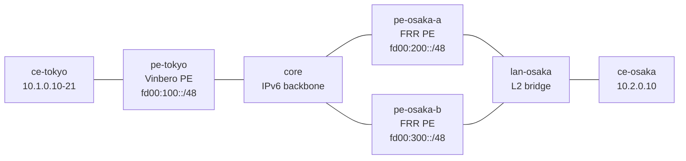

# ecmp-2site — ECMP path group と prober fast reroute (Vinbero <-> FRR ×2)

*(English: [README.md](./README.md))*

遠端のカスタマーサイトが独立した 2 台の FRR PE に dual-home され、両方が同じ prefix を広告する [containerlab](https://containerlab.dev/) シナリオです。Vinbero PE は 2 本の VPNv4 path を 1 つの ECMP path group に集約し、inner 5-tuple hash で両 PE に flow を分散し、各 path に SRv6 liveness prober を走らせます。片方の FRR PE の underlay を経路途中で切断すると、prober が数百ミリ秒でその path をマスクします。iBGP の hold time はここでは 30 秒で、トラフィックを救うには意図的に遅すぎる設定です。

## トポロジ



3 台の PE はすべてプロバイダ AS 65100 に属します。Vinbero は両 FRR PE と loopback 間で iBGP を張り、各 FRR PE は共有サイト LAN の connected な `10.2.0.0/24` を、それぞれ固有の RD (`65200:200` / `65300:200`) と locator (`fd00:200::/48` / `fd00:300::/48`)、共通の route target `65000:200` で export します。

## 検証内容

1. 受信側の ECMP 集約を確認します。RD も SID も異なる同一 prefix の 2 広告が、last-write-wins ではなく member 2 本の 1 group に載ります
2. per-flow の分散を確認します。inner source が異なる 12 本の ping flow が両 member に hash され、両 FRR PE が実際に encap 済みトラフィックを受け取ることを assert します
3. prober の生存監視を確認します。`vbctl prober status` に path ごとの probe (宛先は各 FRR PE の loopback) が up で並びます
4. fast reroute を確認します。`core` が pe-osaka-b 向けの経路を削除すると (admin link down は veth 両端の IPv6 address を flush してラボを path 障害以上に壊すため使いません)、prober が path をマスクし (100ms probe を 3 回喪失)、BGP がまだ両 path を信じている間に全 flow が pe-osaka-a 経由で流れ続けます
5. 復旧を確認します。経路を戻すと path が復帰し (3 回連続応答)、分散が再開します

## 実行方法

```bash
cd examples/interop-clab
make all SCENARIO=ecmp-2site
```

Docker、containerlab、sudo が必要です。ホスト kernel に `vrf` モジュールが要ります (`modprobe vrf`)。デプロイ済みのラボに対しては `make test SCENARIO=ecmp-2site` で assert だけ再実行できます。
