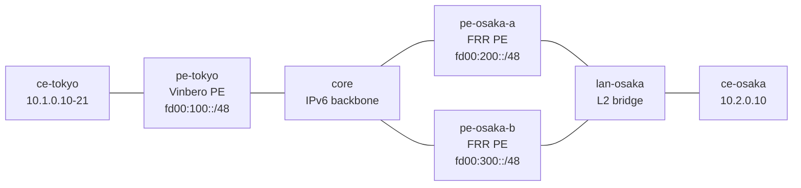

# ecmp-2site — ECMP path groups + prober fast reroute (Vinbero <-> FRR ×2)

*(日本語: [README.ja.md](./README.ja.md))*

A [containerlab](https://containerlab.dev/) scenario where the far customer
site is dual-homed to **two independent FRR PEs** that both advertise the same
prefix. The Vinbero PE aggregates the two VPNv4 paths into one ECMP path
group, spreads flows across both PEs by inner 5-tuple hash, and runs the SRv6
liveness prober against each path. Cutting one FRR PE's underlay mid-path is
masked by the prober in hundreds of milliseconds — the iBGP hold time is 30
seconds here, deliberately too slow to be the thing that saves the traffic.

## Topology



All three PEs are in provider AS 65100. Vinbero peers iBGP over loopbacks
with both FRR PEs; each FRR PE exports the connected `10.2.0.0/24` of the
shared site LAN under its own RD (`65200:200` / `65300:200`) and locator
(`fd00:200::/48` / `fd00:300::/48`), with the shared route target
`65000:200`.

## What it proves

1. **Receive-side ECMP aggregation.** The two advertisements of one prefix —
   different RDs, different SIDs — land in a single ECMP path group with two
   members instead of last-write-wins.
2. **Per-flow spread.** Twelve ping flows (distinct inner sources) are hashed
   across both members; the test asserts both FRR PEs actually receive
   encapsulated traffic.
3. **Prober liveness.** `vbctl prober status` shows one probe per path,
   terminating at each FRR PE's loopback, both up.
4. **Fast reroute.** `core` drops the pe-osaka-b link. The prober masks the
   path (three lost 100ms probes) and every flow keeps flowing through
   pe-osaka-a while BGP still believes both paths exist.
5. **Recovery.** Restoring the link brings the path back (three answered
   probes) and traffic spreads again.

## Running

```bash
cd examples/interop-clab
make all SCENARIO=ecmp-2site
```

Needs Docker, containerlab and sudo; the host kernel must have the `vrf`
module (`modprobe vrf`). `make test SCENARIO=ecmp-2site` re-runs the
assertions against a deployed lab.
