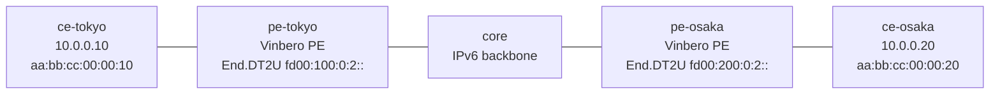

# evpn-2site — BGP EVPN による SRv6 L2VPN (Vinbero ⇄ Vinbero)

*(English: [README.md](./README.md))*

2 台の Vinbero PE が SRv6 EVPN L2VPN (ELAN) を構成する [containerlab](https://containerlab.dev/) シナリオ。各 PE は自分の配下の customer MAC を BGP EVPN RT2 (MAC/IP Advertisement, AFI 25 / SAFI 70) として自分の End.DT2U service SID 付きで広告し、相手の RT2 をインストールしてユニキャスト L2 フレームを相手へ転送する。2 つの customer host は同一サブネットに属し、SRv6 コアをまたいで L2 で bridge される。コントローラも FRR もなく、BGP EVPN だけで成立する stretched broadcast domain となる。

## トポロジ



1 つの bridge domain (bd 100) を SRv6 上に伸ばす。両 PE は provider AS 65100 に属し、loopback (`2001:db8:ff::1` / `::2`) で iBGP を張って EVPN family を運ぶ。`core` は外側ヘッダだけで転送する素の IPv6 ルータ。

## 何を確認するか

1. BGP EVPN (RT2) による MAC 交換。各 PE は相手の customer MAC を BGP で学習し、その RT2 が `fdb_map` に remote エントリとして現れ、相手の End.DT2U SID を segment に持つ `bd_peer` を指す。SAFI 70 のセッションと RT2 / SRv6 L2 Service TLV の decode が両方動作する。
2. データプレーンの双方向通信。`ce-tokyo` と `ce-osaka` が stretched L2 domain 越しに ping でき、フレームは相手の End.DT2U SID へ H.Encaps.L2 され (core 上で外側 DA を capture して確認)、相手側の bridge に decap される。BGP で学習した RT2 が実際に L2 転送経路を駆動する。

## スコープ

RT2 (ユニキャスト) のみ。BUM flooding (broadcast / unknown-unicast) は RT3 (Inclusive Multicast) が要るため後のフェーズとし、ここでは customer host 同士に static ARP を入れて純粋なユニキャストに保つ。multi-homing (RT4 / ESI / DF election) と、データプレーンで学習した MAC の自動広告も後のフェーズで、ここでは各 PE が起動時に明示的に自分の customer MAC を広告する。

## 実行

```bash
cd examples/interop-clab
make all SCENARIO=evpn-2site      # build + deploy + test + destroy
# または個別に:
make build  SCENARIO=evpn-2site
make deploy SCENARIO=evpn-2site
make test   SCENARIO=evpn-2site
make destroy SCENARIO=evpn-2site
```

Docker、containerlab、sudo が必要。`vrf` カーネルモジュールは不要 (L2VPN なので customer VRF を作らない)。

## 構成の仕組み

各 PE (`pe-*/start.sh` と `pe-*/vinbero.yml` を参照):

- customer 側ポート (`eth2`) を `br100` 経由で bd 100 に bridge し、`hl2` (headend-L2) エントリを登録する。あわせて、core からのフレームを `br100` に decap する `END_DT2` SID を登録する。
- bd 100 を EVPN import route target `65000:100` に、起動時に `vinbero.yml` の `bgp.vrf_bindings` で bind する。起動後に `vbctl bgp vrf-bind` で bind するのではなく config で bind することで、早く到着した相手の RT2 が bridge domain binding 不在で drop されるのを防ぐ。
- `vbctl bgp advertise-evpn-mac` で自分の customer MAC を、自分の End.DT2U SID と export RT を付けて広告する。

受信した RT2 は `fdb_map[bd, peer-MAC] → bd_peer(End.DT2U SID)` をインストールし、customer 側の XDP headend がユニキャストフレームをその SID へ H.Encaps.L2 する。
