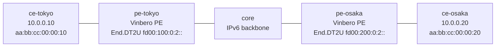

# evpn-2site — SRv6 EVPN L2VPN over BGP (Vinbero ⇄ Vinbero)

*(日本語: [README.ja.md](./README.ja.md))*

A [containerlab](https://containerlab.dev/) scenario where two Vinbero PEs run
an SRv6 EVPN L2VPN (ELAN). Each PE advertises its local customer MAC as a BGP
EVPN RT2 (MAC/IP Advertisement, AFI 25 / SAFI 70) carrying its own End.DT2U
service SID, and installs the peer's RT2 to forward unicast L2 frames toward
it. The two customer hosts sit in one subnet and are bridged at L2 across the
SRv6 core — a stretched broadcast domain signalled entirely by BGP EVPN, with
no separate controller and no FRR.

## Topology



One bridge domain (bd 100) stretched over SRv6. Both PEs are in provider AS
65100 and peer iBGP over their loopbacks (`2001:db8:ff::1` / `::2`) carrying
the EVPN family. `core` is a plain IPv6 router that forwards by the outer
header.

## What it proves

1. **MAC exchange over BGP EVPN (RT2).** Each PE learns the peer's customer
   MAC over BGP — the RT2 appears in `fdb_map` as a remote entry pointing at a
   `bd_peer` whose segment is the peer's End.DT2U SID. The SAFI 70 session and
   the RT2 / SRv6 L2 Service TLV decode both work.
2. **Data plane, both directions.** `ce-tokyo` ⇄ `ce-osaka` ping over the
   stretched L2 domain, with the frame H.Encaps.L2'd toward the peer's
   End.DT2U SID (the outer DA captured on the core link) and decapped into the
   far bridge — BGP-learned RT2 actually drives the L2 forwarding path.

## Scope

RT2 (unicast) only. BUM flooding (broadcast / unknown-unicast) needs RT3
(Inclusive Multicast), a later phase, so the customer hosts carry static ARP
for each other to keep the traffic pure unicast. Multi-homing (RT4 / ESI / DF
election) and the advertise of data-plane-learned MACs are also later phases;
here each PE advertises its customer MAC explicitly at boot.

## Run

```bash
cd examples/interop-clab
make all SCENARIO=evpn-2site      # build + deploy + test + destroy
# or step by step:
make build  SCENARIO=evpn-2site
make deploy SCENARIO=evpn-2site
make test   SCENARIO=evpn-2site
make destroy SCENARIO=evpn-2site
```

Needs Docker, containerlab, and sudo. The `vrf` kernel module is not required
(this is an L2VPN; no customer VRF).

## How it is wired

Each PE (see `pe-*/start.sh` and `pe-*/vinbero.yml`):

- bridges its customer port (`eth2`) into bd 100 via `br100` and an `hl2`
  (headend-L2) entry, and registers an `END_DT2` SID that decaps a core-bound
  frame into `br100`;
- binds bd 100 to the EVPN import route target `65000:100` at boot through
  `bgp.vrf_bindings` in `vinbero.yml`. Binding in config (rather than via
  `vbctl bgp vrf-bind` after boot) means a peer's RT2 that arrives early is not
  dropped for lack of a bridge-domain binding;
- advertises its customer MAC with `vbctl bgp advertise-evpn-mac`, carrying its
  own End.DT2U SID and the export RT.

A received RT2 then installs `fdb_map[bd, peer-MAC] → bd_peer(End.DT2U SID)`,
and the customer-facing XDP headend H.Encaps.L2's unicast frames toward it.
