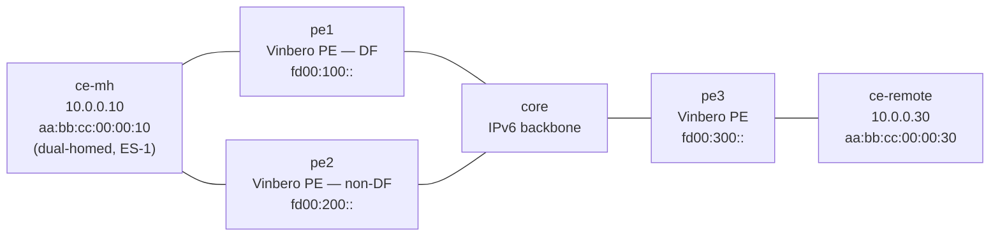

# evpn-multihoming — SRv6 EVPN multi-homing (RT4 DF election + split-horizon)

*(English: [README.md](./README.md))*

3 台の Vinbero PE が SRv6 EVPN L2VPN (ELAN) を構成し、そのうち 1 つの customer を multi-home する [containerlab](https://containerlab.dev/) シナリオ。`ce-mh` は共有 Ethernet Segment (ES-1) を通じて `pe1` と `pe2` の両方に接続し、`pe3` は single-home の `ce-remote` を収容する remote PE となる。`pe1` と `pe2` はこの segment を ES-Import route target 付きの BGP EVPN RT4 (Ethernet Segment route, AFI 25 / SAFI 70) として広告し、各 PE が独立に RFC 8584 の default DF election を実行して 1 つの Designated Forwarder で合意する。split-horizon と組み合わせて、BUM トラフィックが multi-home された CE へ 2 回以上届くことと転送ループを防ぐ。コントローラも FRR もなく、BGP EVPN だけで multi-homing を実現する。

## トポロジ



1 つの bridge domain (bd 100) を SRv6 上に伸ばす。3 台の PE はいずれも provider AS 65100 に属し、loopback (`2001:db8:ff::1` / `::2` / `::3`) で iBGP full mesh を張って EVPN family を運ぶ。`ce-mh` は MAC を固定した共有 Linux bridge を通じて `pe1` と `pe2` の両方に届き、同じ customer MAC が 1 つの Ethernet Segment ES-1 (`00:00:00:00:00:00:00:00:00:01`) 上で学習される。`core` は外側ヘッダだけで転送する素の IPv6 ルータ。

## 何を確認するか

1. BGP EVPN による ES membership と DF election。`pe1` と `pe2` はそれぞれ ES-1 を ES-Import RT `00:00:00:00:00:01` と自分の encap source を next hop に持つ RT4 として広告する。各 PE は受信した RT4 と自分の local source から候補集合 {`fd00:100::`, `fd00:200::`} を集め、RFC 8584 の ordinal election (`ETag mod N`、ELAN は ETag 0 なので最小の source) を実行する。両 PE が独立に `fd00:100::` (pe1) を DF に選出し、election は決定的で PE 間で一致する。
2. RT2 による MAC 交換。`pe3` は `ce-mh` の MAC を、`pe1` と `pe2` は `ce-remote` の MAC を RT2 で学習する (相手の End.DT2U SID へ向かう `fdb_map` の remote エントリ)。
3. データプレーンの双方向通信。`ce-mh` と `ce-remote` が SRv6 コアをまたいで stretched L2 domain 越しに ping できる。
4. BUM の単一配送。`pe3` から `pe1` と `pe2` の両 End.DT2M へ flood された BUM フレームが multi-home された `ce-mh` にちょうど 1 回だけ届く。DF (`pe1`) が転送し、non-DF (`pe2`) は `dt2m_non_df_drop` で drop する。さらに split-horizon が、一方の PE が他方の BUM を共有 CE へ再 flood するのを防ぐ。このため `ce-remote` は重複した (`DUP!`) 応答を受け取らない。

## スコープ

RT4 (Ethernet Segment) と RFC 8584 DF election、Local-Bias / static-DF の split-horizon を、[evpn-2site](../evpn-2site/) の RT2 (ユニキャスト) + RT3 (Inclusive Multicast / BUM flood) コアの上に重ねる。redundancy は `SINGLE_ACTIVE` で、customer host は flood 越しに ARP を動的解決する。各 PE は自分の customer MAC と flood 宛先を、multi-home する PE はさらに Ethernet Segment を、起動時に明示的に広告する。

## 実行

```bash
cd examples/interop-clab
make all SCENARIO=evpn-multihoming      # build + deploy + test + destroy
# または個別に:
make build   SCENARIO=evpn-multihoming
make deploy  SCENARIO=evpn-multihoming
make test    SCENARIO=evpn-multihoming
make destroy SCENARIO=evpn-multihoming
```

Docker、containerlab、sudo が必要。`vrf` カーネルモジュールは不要 (L2VPN なので customer VRF を作らない)。

## 構成の仕組み

multi-home する PE (`pe1` / `pe2`、`pe*/start.sh` と `pe*/vinbero.yml` を参照):

- ES 側の customer ポート (`eth2`) を bd 100 に bridge し、`vbctl es create --esi <ESI> --local-attached --mode SINGLE_ACTIVE` で Ethernet Segment を登録する。あわせて `hl2` headend に同じ ESI を付けて TX/RX split-horizon に使う。
- core からのフレームを `br100` に届ける `END_DT2` SID (ユニキャスト decap) と `END_DT2M` SID (BUM flood decap) を登録する。
- customer MAC を `advertise-evpn-mac` (End.DT2U SID) で、flood 宛先を `advertise-evpn-imet` (End.DT2M SID) で、Ethernet Segment を `advertise-evpn-es` (ES-Import RT、next hop は local encap source) で広告する。local に attach した ESI に対する RT4 を受信すると DF election を再実行し、勝者を `esi_map` に書く。non-DF の PE は End.DT2M で decap した BUM を CE へ drop する。

`pe3` は single-home で、`ce-remote` を ESI も RT4 もなく通常どおり収容し、`ce-mh` を RT2 で学習して `pe1` / `pe2` の両 End.DT2M へ flood する。

ESI は type 0 (arbitrary) を使う。先頭バイトが ESI type なので、先頭が `01` だと最終オクテットが `0x00` でなければならない LACP ESI として parse されて reject される。type 0 にはそうした構造上の制約がない。

### iBGP full mesh と passive neighbor

3 ノードの iBGP full mesh では、各ペアの両端が同時に互いへ接続を張る。この connection collision により gobgp は ESTABLISHED 直後の socket を落とし、セッションが flap する。各ペアを 1 つの TCP 方向に固定するため、loopback の大きい側の neighbor を `vinbero.yml` で `passive: true` にする (pe2 から pe1 へ、pe3 から pe1 と pe2 へ)。これで loopback の小さい側だけが接続を張り、collision が起きない。
