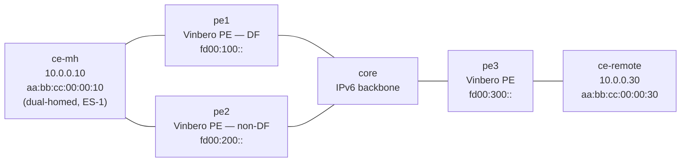

# evpn-multihoming — SRv6 EVPN multi-homing (RT4 DF election + split-horizon)

*(日本語: [README.ja.md](./README.ja.md))*

A [containerlab](https://containerlab.dev/) scenario where three Vinbero PEs run
an SRv6 EVPN L2VPN (ELAN) in which one customer is **dual-homed**. `ce-mh`
attaches to both `pe1` and `pe2` through a shared Ethernet Segment (ES-1); `pe3`
is the remote PE for the single-homed `ce-remote`. `pe1` and `pe2` advertise the
segment as a BGP EVPN RT4 (Ethernet Segment route, AFI 25 / SAFI 70) carrying an
ES-Import route target, each independently runs the RFC 8584 default DF election,
and they agree on a single Designated Forwarder. Combined with split-horizon,
this keeps BUM traffic from reaching the dual-homed CE more than once and stops a
forwarding loop — multi-homing signalled entirely by BGP EVPN, with no separate
controller and no FRR.

## Topology



One bridge domain (bd 100) stretched over SRv6. All three PEs are in provider AS
65100 and peer iBGP in a full mesh over their loopbacks
(`2001:db8:ff::1` / `::2` / `::3`) carrying the EVPN family. `ce-mh` reaches both
`pe1` and `pe2` through a shared Linux bridge with a pinned MAC, so the same
customer MAC is learned on the one Ethernet Segment ES-1
(`00:00:00:00:00:00:00:00:00:01`). `core` is a plain IPv6 router that forwards by
the outer header.

## What it proves

1. **ES membership + DF election over BGP EVPN.** `pe1` and `pe2` each advertise
   ES-1 as an RT4 with the ES-Import RT `00:00:00:00:00:01` and their own encap
   source as the next hop. Each PE collects the candidate set
   {`fd00:100::`, `fd00:200::`} from the received RT4 plus its local source and
   runs the RFC 8584 ordinal election (`ETag mod N`, ELAN ETag 0 → lowest
   source). Both independently elect **`fd00:100::` (pe1)** as DF — the election
   is deterministic and agrees across PEs.
2. **MAC exchange over RT2.** `pe3` learns `ce-mh`'s MAC and both `pe1`/`pe2`
   learn `ce-remote`'s MAC over RT2 (a `fdb_map` remote entry toward the peer's
   End.DT2U SID).
3. **Data plane, both directions.** `ce-mh` ⇄ `ce-remote` ping over the stretched
   L2 domain across the SRv6 core.
4. **BUM single delivery.** A BUM frame flooded from `pe3` toward both `pe1` and
   `pe2`'s End.DT2M reaches the dual-homed `ce-mh` **exactly once**: the DF
   (`pe1`) forwards while the non-DF (`pe2`) drops at `dt2m_non_df_drop`, and
   split-horizon prevents either PE re-flooding the other's BUM back to the
   shared CE. `ce-remote` therefore sees no duplicate (`DUP!`) replies.

## Scope

RT4 (Ethernet Segment) + RFC 8584 DF election + Local-Bias / static-DF
split-horizon, layered on the RT2 (unicast) + RT3 (Inclusive Multicast / BUM
flood) core from [evpn-2site](../evpn-2site/). `SINGLE_ACTIVE` redundancy; the
customer hosts resolve ARP dynamically over the flood. Each PE advertises its
customer MAC, flood endpoint, and (on the multi-homed PEs) Ethernet Segment
explicitly at boot.

## Run

```bash
cd examples/interop-clab
make all SCENARIO=evpn-multihoming      # build + deploy + test + destroy
# or step by step:
make build   SCENARIO=evpn-multihoming
make deploy  SCENARIO=evpn-multihoming
make test    SCENARIO=evpn-multihoming
make destroy SCENARIO=evpn-multihoming
```

Needs Docker, containerlab, and sudo. The `vrf` kernel module is not required
(this is an L2VPN; no customer VRF).

## How it is wired

The multi-homed PEs (`pe1` / `pe2`, see `pe*/start.sh` and `pe*/vinbero.yml`):

- bridge the ES-facing customer port (`eth2`) into bd 100 and register the
  Ethernet Segment with `vbctl es create --esi <ESI> --local-attached
  --mode SINGLE_ACTIVE`, then tag the `hl2` headend with the same ESI for TX/RX
  split-horizon;
- register `END_DT2` (unicast decap) and `END_DT2M` (BUM flood decap) SIDs that
  deliver a core-bound frame into `br100`;
- advertise the customer MAC (`advertise-evpn-mac`, End.DT2U SID), the flood
  endpoint (`advertise-evpn-imet`, End.DT2M SID), and the Ethernet Segment
  (`advertise-evpn-es`, ES-Import RT, next hop = local encap source). A received
  RT4 for a locally attached ESI re-runs the DF election and writes the winner to
  `esi_map`; the non-DF PE then drops End.DT2M-decapped BUM toward the CE.

`pe3` is single-homed: it attaches `ce-remote` normally with no ESI and no RT4,
learns `ce-mh` via RT2, and floods toward both `pe1`/`pe2`'s End.DT2M.

The ESI uses **type 0 (arbitrary)**: the leading byte is the ESI type, so a
leading `01` would be parsed as a LACP ESI whose last octet must be `0x00` and
gets rejected. Type 0 carries no such structural constraint.

### iBGP full mesh and passive neighbors

A three-node iBGP full mesh has both ends of every pair dial each other at once.
That connection collision makes gobgp tear a freshly ESTABLISHED socket back
down and the session flaps. To pin each pair to a single TCP direction, the
neighbor with the higher loopback is marked `passive: true` in `vinbero.yml`
(pe2 toward pe1; pe3 toward pe1 and pe2). Only the lower-loopback end dials, so
no collision occurs.
