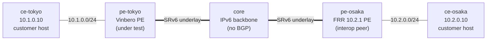

# l3vpn-2site — 2 拠点 SRv6 L3VPN interop (Vinbero ⇄ FRR)

*(English: [README.md](./README.md))*

教科書どおりの 2 拠点 SRv6 L3VPN を **Vinbero**（テスト対象）と **FRRouting** の 2 PE で構築する [containerlab](https://containerlab.dev/) シナリオ。**制御プレーン**（RFC 9252 SRv6 Service TLV を載せた VPNv4/VPNv6 経路を iBGP で交換、§4 SID-structure **transposition** を含む）と**データプレーン**（2 つの顧客ホスト間の実 `ping` が L3VPN を end-to-end で通る）を検証する。FRR は*このシナリオ*の peer — ライブラリ全体は [interop-clab 概要](../../README.md) を参照。

## トポロジ



| ノード                  | 役割                                                   |
|-------------------------|--------------------------------------------------------|
| `ce-tokyo` / `ce-osaka` | 顧客ホスト — `10.1.0.10` / `10.2.0.10`。                |
| `pe-tokyo`              | テスト対象の Vinbero PE（`vinberod --bgp-enabled`、XDP）。|
| `pe-osaka`              | FRR 10.2.1 PE（interop 相手）。                         |
| `core`                  | プロバイダ backbone — 素の IPv6 ルータ、静的経路。      |

コンテナ名は `clab-l3vpn-2site-<node>`。

## 設計

- **iBGP・単一プロバイダ AS (65100)。** 両 PE は loopback (`2001:db8:ff::1` / `::2`) 同士で iBGP（VPNv4 + VPNv6）をピアする — 教科書どおりの L3VPN モデル。iBGP は元々マルチホップ対応なので `ebgp-multihop` 不要。`core` は BGP に関与せず、IPv6 underlay を静的経路でルーティングするのみ（IGP なし＝収束レースなし）。
- **アドレッシング。** underlay `2001:db8:1::/64`・`2001:db8:2::/64`、SRv6 locator `fd00:100::/48`（Vinbero）/ `fd00:200::/48`（FRR）、顧客 subnet `10.1.0.0/24` / `10.2.0.0/24`（両者とも単一 VRF）。
- **データプレーン。** 各 PE は顧客トラフィックを対向 PE の service SID 向けに H.Encaps し、戻り方向用に End.DT4 decap を持つ。コアは外側 IPv6 ヘッダのみで転送。Vinbero は両ポートに XDP を attach（eth2 = H.Encaps、eth1 = End.DT4 decap）。

コンテナイメージは interop-clab ライブラリ共有で `../../images/` にある。

## 実行

Docker・`containerlab`・`sudo` が必要。`examples/interop-clab/` から:

```bash
make all                        # build + deploy + test + destroy
```

`make build` / `deploy` / `test` / `destroy` は各ステップを個別に実行、`make status` / `logs` は BGP・デーモンの状態をダンプする。`l3vpn-2site` がデフォルトシナリオ（明示するなら `make all SCENARIO=l3vpn-2site`）。

## test.sh が検証する内容

1. **iBGP セッション ESTABLISHED** — 両側。
2. **FRR → Vinbero (decode)** — FRR の `10.2.0.0/24` VPN 経路が Vinbero の `headend_v4` map に設置され、RFC 9252 §4 transposition でフル SID が復元される。
3. **Vinbero → FRR (encode)** — Vinbero が広告した `10.1.0.0/24` が FRR の VPN RIB に SID 付きで届き、`vrf-cust` に設置される。
4. **データプレーン** — `ce-tokyo` ⇄ `ce-osaka` の `ping` が双方向成功。

データプレーンは非同期に収束する（XDP attach、BGP 収束、FRR の `seg6` localsid、NDP）ため、section 4 は ping 前に全 readiness 条件を gate する — 収束が遅くても誤った `FAIL` は生じない。成功時は `RESULT: 8 passed, 0 failed` を出力する。

## 注記

- **FRR は固定** — `quay.io/frrouting/frr:10.2.1`。SRv6 L3VPN 構文はバージョン依存が大きいので、更新は `frr.conf` のレビューとセットで。
- **transposition** — FRR は SID の function bits を VPN label に転置するため wire 上の SID は bare locator `fd00:200::`。Vinbero のデコーダ (`pkg/bgp/gobgp/decode.go`) がこれを畳み戻してフル SID `fd00:200:0:1::` を復元する。`test.sh` step 2 がアサートする。
- XDP は **generic** モードで attach — containerlab の veth は native XDP に非対応。
- `core/`・`frr/`・`vinbero/` の `start.sh` が残りのセットアップ（VRF 作成順、source locator 登録、loopback ソースの iBGP、FRR の SRv6 nexthop validation 用 connected 経路、`net.vrf.strict_mode`）を担う — 詳細は各スクリプトのインラインコメント参照。
