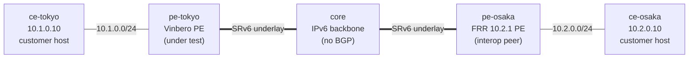

# l3vpn-2site — 2-site SRv6 L3VPN interop (Vinbero ⇄ FRR)

*(日本語: [README.ja.md](./README.ja.md))*

A [containerlab](https://containerlab.dev/) scenario: a textbook 2-site
SRv6 L3VPN with **Vinbero** (under test) and **FRRouting** as the two
PEs. It verifies the **control plane** — VPNv4/VPNv6 routes carrying
RFC 9252 SRv6 Service TLVs exchanged over iBGP, including §4 SID-structure
**transposition** — and the **data plane** — a real `ping` between two
customer hosts riding the L3VPN end to end. FRR is the peer for *this*
scenario; see the [interop-clab overview](../../README.md).

## Topology



| Node                    | Role                                                   |
|-------------------------|--------------------------------------------------------|
| `ce-tokyo` / `ce-osaka` | Customer hosts — `10.1.0.10` / `10.2.0.10`.            |
| `pe-tokyo`              | Vinbero PE under test (`vinberod --bgp-enabled`, XDP). |
| `pe-osaka`              | FRR 10.2.1 PE (interop peer).                          |
| `core`                  | Provider backbone — plain IPv6 router, static routes.  |

Containers are named `clab-l3vpn-2site-<node>`.

## Design

- **iBGP, one provider AS (65100).** Both PEs peer iBGP (VPNv4 + VPNv6)
  on their loopbacks (`2001:db8:ff::1` / `::2`) — the textbook L3VPN
  model. iBGP is naturally multi-hop, so no `ebgp-multihop`. `core` is
  not in BGP; it only routes the IPv6 underlay with static routes (no
  IGP, hence no convergence race).
- **Addressing.** Underlay `2001:db8:1::/64` & `2001:db8:2::/64`;
  SRv6 locators `fd00:100::/48` (Vinbero) / `fd00:200::/48` (FRR);
  customer subnets `10.1.0.0/24` / `10.2.0.0/24`, both in one VRF.
- **Data plane.** Each PE H.Encaps customer traffic toward the far PE's
  service SID and runs an End.DT4 decap for the return direction; the
  core forwards purely by the outer IPv6 header. Vinbero attaches XDP on
  both ports (eth2 = H.Encaps, eth1 = End.DT4 decap).

Container images are shared across the interop-clab library in
`../../images/`.

## Run

Needs Docker, `containerlab` and `sudo`. From `examples/interop-clab/`:

```bash
make all                        # build + deploy + test + destroy
```

`make build` / `deploy` / `test` / `destroy` run the steps individually;
`make status` / `logs` dump BGP and daemon state. `l3vpn-2site` is the
default scenario (`make all SCENARIO=l3vpn-2site` to name it explicitly).

## What `test.sh` checks

1. **iBGP session ESTABLISHED** — both sides.
2. **FRR → Vinbero (decode)** — FRR's `10.2.0.0/24` VPN route lands in
   Vinbero's `headend_v4` map, with the full SID reconstructed via
   RFC 9252 §4 transposition.
3. **Vinbero → FRR (encode)** — Vinbero's advertised `10.1.0.0/24`
   reaches FRR's VPN RIB with the SID intact and installs into `vrf-cust`.
4. **Data plane** — `ping` succeeds both ways, `ce-tokyo` ⇄ `ce-osaka`.

The data plane settles asynchronously (XDP attach, BGP convergence, FRR
`seg6` localsid, NDP), so section 4 gates on every readiness
precondition before pinging — a slow settle cannot cause a spurious
`FAIL`. A pass prints `RESULT: 8 passed, 0 failed`.

## Notes

- **FRR is pinned** to `quay.io/frrouting/frr:10.2.1` — its SRv6 L3VPN
  syntax is version-sensitive; bump only with a `frr.conf` review.
- **Transposition** — FRR transposes the SID function bits into the VPN
  label, so the on-wire SID is the bare locator `fd00:200::`; Vinbero's
  decoder (`pkg/bgp/gobgp/decode.go`) folds them back to the full SID
  `fd00:200:0:1::`. `test.sh` step 2 asserts this.
- XDP attaches in **generic** mode — containerlab veth links have no
  native XDP.
- The `core/`, `frr/` and `vinbero/` `start.sh` scripts carry the
  remaining setup glue — VRF creation order, source-locator
  registration, loopback-sourced iBGP, FRR's connected-route requirement
  for SRv6 nexthop validation, `net.vrf.strict_mode` — documented in
  their inline comments.
