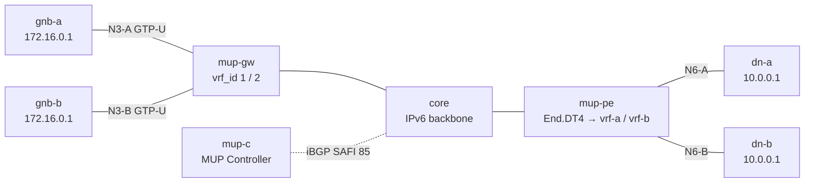

# mup-2site-multivrf — 1 台の GW に 2 つの VRF、F-TEID 完全重複

*(English: [README.md](./README.md))*

MUP uplink の per-VRF スコープを検証する
[containerlab](https://containerlab.dev/) シナリオです。2 つの VPN (A / B) が
1 台の Vinbero MUP-GW と 1 台の Vinbero MUP-PE を共有し、VPN として重複し得る
ものを意図的にすべて重複させます。N3 endpoint (`172.16.0.254`)、TEID
(`256`)、inner の UE (`10.1.0.1`)、DN ホスト (`10.0.0.1`) まで同一で、uplink
トラフィックを分けるのは GW のどの access interface に届いたかだけです。

## トポロジ



## 検証する内容

F-TEID map は uplink セッションを {vrf_id, endpoint, TEID prefix} でキーし、
ingress front door (`ingress_vrf_map` を XDP 入口で `tailcall_ctx.vrf_id` に
解決) が ingress access circuit ({interface, VLAN}) からパケットを VRF に
分類する。per-VRF キーが無ければ、下の 2 つの T2ST は同じ {endpoint, TEID}
で衝突して後勝ちになる。

- mup-gw は VPN ごとに VRF を runtime に定義する。`vbctl vrf ac-add --vrf
  vpn-a --interface eth1` が ingress access circuit を追加して VRF の vrf_id
  を割り当て、`vbctl vrf-bgp bind --vrf vpn-a --rt mup_ipv4:100:6001:import`
  が同じ VRF に BGP policy を attach する (vpn-b は eth2 で対称)。import RT が
  どの T2ST をその VRF に install するかを決め、AC membership がどのパケットを
  その VRF に分類するかを決める。
- mup-c は `{endpoint, TEID}` が同一の SID なし T2ST を 2 本 advertise する。
  違いは RD (advertiser ごと)、RT (uplink VPN ごと)、MUP segment id だけ。
- mup-pe は VPN ごとの DSD (segment id `1:1` / `1:2`、per-VPN の End.DT4
  direct SID 付き) を advertise し、同一アドレッシングの N6 を持つ kernel
  VRF vrf-a / vrf-b をホストする。

RD と RT の使い分けは次のとおり。RD は per-advertiser (controller の
セッションは `65100:1` / `65100:2`、PE の DSD は `65100:21` / `65100:22`)、
VPN の所属と解決のスコープは RT (`100:6001` が A、`100:6002` が B) が決め、
segment id が各 T2ST を自 VPN の DSD と結ぶ。

## データ経路

uplink のみ (downlink と PE 側の headend per-VRF キーは対象外。双方向の経路は
mup-2site を参照)。

- `gnb-a → dn-a`: `172.16.0.254` 宛 GTP-U (TEID 256) が mup-gw の eth1 に
  入る → vrf_id 1 → F-TEID entry A → `fd00:d:0:1::` へ SRv6 → `End.DT4`
  が vrf-a へ decap → dn-a が inner `10.1.0.1 → 10.0.0.1` を受信。
- `gnb-b → dn-b`: byte 単位で同一のパケットが eth2 に入る → vrf_id 2 →
  direct SID `fd00:d:0:2::` → vrf-b → dn-b。

`test.sh` は control plane (同一 {endpoint, TEID} の T2ST 2 本が共有 gate の
下で別 vrf_id に install されること) と、VPN ごとに自分の DN へ届き、
byte 単位で同一の inner を受け入れてしまうはずのもう一方の DN には何も
届かないこと (cross-VRF leak なし) を検証します。

## 実行

```bash
make all SCENARIO=mup-2site-multivrf
```
