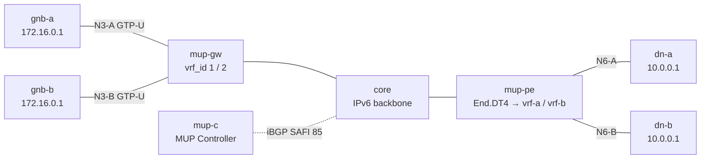

# mup-2site-multivrf — two VRFs on one GW, overlapping F-TEIDs

*(日本語: [README.ja.md](./README.ja.md))*

A [containerlab](https://containerlab.dev/) scenario for **per-VRF MUP uplink
scoping**. Two VPNs (A / B) share one Vinbero MUP-GW and one Vinbero MUP-PE and
deliberately overlap everywhere a VPN may overlap: the same N3 endpoint
(`172.16.0.254`), the same TEID (`256`), the same inner UE (`10.1.0.1`) and the
same DN host (`10.0.0.1`). The only thing separating their uplink traffic is
the GW access interface it arrives on.

## Topology



## What it exercises

The F-TEID maps key uplink sessions as {vrf_id, endpoint, TEID-prefix}, and the
ingress front door (`ingress_vrf_map`, resolved into `tailcall_ctx.vrf_id` at
the XDP entry) classifies a packet to its VRF from the ingress access circuit
({interface, VLAN}). Without per-VRF keying, the two T2STs below would collide
on the same {endpoint, TEID} key and the second install would overwrite the
first.

- mup-gw defines one VRF per VPN at runtime. `vbctl vrf ac-add --vrf vpn-a
  --interface eth1` adds the ingress access circuit (and allocates the VRF's
  vrf_id), and `vbctl vrf-bgp bind --vrf vpn-a --rt mup_ipv4:100:6001:import`
  attaches the BGP policy to the same VRF (the mirror for vpn-b on eth2). The
  import RT decides which T2STs install under the VRF; the AC membership
  decides which packets classify to it.
- mup-c advertises two SID-less T2STs with identical `{endpoint, TEID}`,
  distinguished only by RD (per advertiser), RT (per uplink VPN) and the MUP
  segment id.
- mup-pe advertises one DSD per VPN (segment ids `1:1` / `1:2`) carrying the
  per-VPN End.DT4 direct SIDs, and hosts kernel VRFs vrf-a / vrf-b whose N6
  interfaces carry the SAME data-network addressing.

RD / RT layout: RDs are per-advertiser (controller sessions `65100:1` /
`65100:2`, the PE's DSDs `65100:21` / `65100:22`); VPN membership and
resolution scoping are the RTs (`100:6001` for A, `100:6002` for B), and the
segment id pairs each T2ST with its VPN's DSD.

## Data path

Uplink only (the downlink and PE-side headend per-VRF keying are out of scope
here; see mup-2site for the full bidirectional path):

- `gnb-a → dn-a`: GTP-U to `172.16.0.254` (TEID 256) enters mup-gw on eth1 →
  vrf_id 1 → F-TEID entry A → SRv6 toward `fd00:d:0:1::` → `End.DT4` into
  vrf-a → dn-a receives the inner `10.1.0.1 → 10.0.0.1`.
- `gnb-b → dn-b`: the byte-identical packet enters on eth2 → vrf_id 2 →
  direct SID `fd00:d:0:2::` → vrf-b → dn-b.

`test.sh` asserts the control plane (both T2STs installed under distinct
vrf_ids behind one shared gate) and, for each VPN, that the burst reaches its
own DN and that the other DN — which would happily accept the byte-identical
inner packet — captures nothing (no cross-VRF leak).

## Run

```bash
make all SCENARIO=mup-2site-multivrf     # build image, deploy, test, destroy
```
