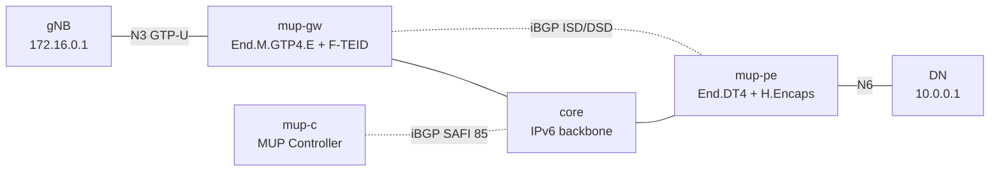

# mup-2site — MUP controller + GW/PE + gNB/DN データ経路

*(English: [README.md](./README.md))*

SRv6 MUP (Mobile User Plane; SAFI 85、`draft-mpmz-bess-mup-safi`、RFC 9433) の
containerlab シナリオです。MUP Controller が iBGP で UE セッション状態を配り、
Vinbero の MUP edge ノード 2 台 (access 側の MUP-GW と data 側の MUP-PE) が SRv6
GTP データプレーンを program し、模した gNB・DN が双方向の GTP-U ⇄ SRv6
トラフィックを流します。

## トポロジ



役割 (RFC 9433):

| ノード | 役割 |
|------|------|
| `mup-c` | MUP Controller。**T1ST/T2ST のみ** (実 controller が mobile control plane から学ぶ per-UE セッション状態) を advertise し、**SRv6 SID は載せない**。データは転送しない |
| `mup-gw` | gNB 側 **MUP-GW** (MUP Gateway)。interwork segment `End.M.GTP4.E` (downlink SRv6→GTP) をホストし **自分の ISD を advertise**、受信 T2ST を mup-pe の DSD で解決して direct SID を得て uplink `H.M.GTP4.D_TEID` gate + F-TEID (GTP→SRv6) を install |
| `mup-pe` | DN 側 **MUP-PE** (MUP Provider Edge)。direct segment `End.DT4`→DN VRF (uplink 配送) をホストし **自分の DSD を advertise**、受信 T1ST を mup-gw の ISD で解決して interwork SID を得て UE prefix `10.1.0.1/32` への downlink `H.Encaps` を install |
| `gnb` / `dn` | トラフィック端点。gNB は N3 (`172.16.0.0/24`) で GTP-U/IPv4 を送受信、DN はデータ網 (`10.0.0.0/24`) |
| `core` | 素の IPv6 backbone (SRv6 underlay + iBGP transport) |

iBGP (AS 65100) は full mesh。`mup-c` ↔ 各 edge ノードがセッション経路を、
`mup-gw` ↔ `mup-pe` が segment discovery 経路を運ぶ。コンテナ名は
`clab-mup-2site-<node>`。

## SID 解決 (RFC 9433 §3)

controller はセッション状態だけを advertise し SID は載せない。各 edge ノードは
相手の discovery 経路から SID を解決するので、controller は SRv6 locator を
知らなくてよい。

- T1ST → ISD (downlink): mup-pe は T1ST の gNB endpoint (`172.16.0.1`) を含む
  ISD prefix (`172.16.0.0/24`) から interwork SID `fd00:a:0:1::` を解決。
- T2ST → DSD (uplink): mup-gw は同じ MUP segment id (`1:2`) を持つ DSD から
  direct SID `fd00:d:0:1::` を解決。

解決は到着順に依存しない。discovery 経路より先に届いたセッションは deferred と
なり、経路が届いた時点で install する。discovery 経路を withdraw すると依存する
セッションは撤去する。セッションが自分の Prefix-SID を載せる構成も可能で、その
場合は discovery 経路で解決できないときの fallback として使う。各 edge ノードは
受信した全経路を apply するが、自分が面していない方向の install は deferred
または dormant のまま。

## データ経路

- uplink `gNB → DN`: gNB が N3 endpoint `172.16.0.254` へ GTP-U/IPv4 (TEID
  0x100) を送る。mup-gw の gate + F-TEID (`{172.16.0.254, TEID}` → direct SID
  `fd00:d:0:1::`) が GTP を剥がし SRv6 で mup-pe へ。mup-pe の `End.DT4` が DN
  VRF へ decap し、DN が inner `10.1.0.1 → 10.0.0.1` を受信。
- downlink `DN → gNB`: DN が UE `10.1.0.1` へ送る。mup-pe の H.Encaps (UE
  prefix → interwork SID `fd00:a:0:1::`、offset 7 に `Args.Mob.Session(gNB,
  TEID, QFI)`) が SRv6 で mup-gw へ。mup-gw の `End.M.GTP4.E` が args を
  読み GTP-U/IPv4 を gNB へ。gNB が GTP-U (UDP/2152) を受信。

`test.sh` は各 edge ノードが相手の discovery 経路を受信し、セッションを解決して
install したこと (apply ログ + `headend_v4` map) を検証します。controller の経路
が SID を持たないため、これは SID 解決が動いた証明になります。あわせて双方向の
データ経路 (DN で decap された uplink inner、gNB で downlink GTP-U を tcpdump
確認) も検証します。uplink の GTP-U は stdlib のみの `send_gtpu.py` (scapy 不要)
で生成します。

## 実行

```bash
make all SCENARIO=mup-2site
```
