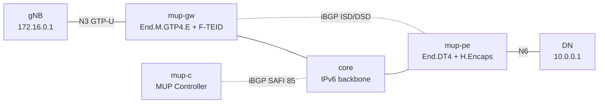

# mup-2site — BGP MUP controller + GW/PE + gNB/DN data path

*(日本語: [README.ja.md](./README.ja.md))*

A [containerlab](https://containerlab.dev/) scenario for SRv6 MUP (Mobile User
Plane; SAFI 85, `draft-mpmz-bess-mup-safi`, RFC 9433). A **MUP Controller**
signals UE-session state over iBGP, two Vinbero MUP edge nodes — a **MUP-GW**
(access side) and a **MUP-PE** (data side) — program the SRv6 GTP data plane
from it, and emulated **gNB / DN** endpoints drive real GTP-U ⇄ SRv6 traffic in
both directions.

## Topology



Roles (RFC 9433):

| Node | Role |
|------|------|
| `mup-c` | MUP Controller. Advertises **only T1ST/T2ST**, and carries **no SRv6 SID** on them (the per-UE-session state, as a real controller learns it from the mobile control plane); forwards no data. |
| `mup-gw` | gNB-facing **MUP-GW** (MUP Gateway). Hosts the interwork segment `End.M.GTP4.E` (downlink SRv6→GTP) and **advertises its ISD**; resolves the T2ST against mup-pe's DSD to get the direct SID, and installs the uplink `H.M.GTP4.D_TEID` gate + F-TEID (GTP→SRv6). |
| `mup-pe` | DN-facing **MUP-PE** (MUP Provider Edge). Hosts the direct segment `End.DT4`→DN VRF (uplink delivery) and **advertises its DSD**; resolves the T1ST against mup-gw's ISD to get the interwork SID, and installs the downlink `H.Encaps` onto the UE prefix `10.1.0.1/32`. |
| `gnb` / `dn` | Traffic endpoints. gNB sends/receives GTP-U/IPv4 on N3 (`172.16.0.0/24`); DN is the data network (`10.0.0.0/24`). |
| `core` | Plain IPv6 backbone (SRv6 underlay + iBGP transport). |

iBGP (AS 65100) is a full mesh: `mup-c` ↔ each edge node carries the session
routes, and `mup-gw` ↔ `mup-pe` carries the segment-discovery routes.
Containers are `clab-mup-2site-<node>`.

## SID resolution (RFC 9433 §3)

The controller advertises session state but no SID. Each edge node resolves the
SID from the peer's discovery route, so the controller never needs to know the
SRv6 locators:

- **T1ST → ISD** (downlink): mup-pe resolves the T1ST's interwork SID from the
  ISD whose prefix (`172.16.0.0/24`) contains the T1ST's gNB endpoint
  (`172.16.0.1`) → `fd00:a:0:1::`.
- **T2ST → DSD** (uplink): mup-gw resolves the T2ST's direct SID from the DSD
  carrying the same MUP segment id (`1:2`) → `fd00:d:0:1::`.

RD / RT layout: RDs are per-advertiser (RFC 4364 §4.2) and only make routes
unique — the controller's sessions carry `65100:1`, mup-gw's ISD `65100:11`,
mup-pe's DSD `65100:12`. VPN membership is decided by RT alone (RFC 4364
§4.3): `100:2000` is the downlink VPN (T1ST + ISD), `100:6000` the uplink VPN
(T2ST + DSD), so both resolutions above cross RDs (RT-scoped). mup-pe's VRF
binding declares both RTs as `mup_ipv4` imports, which activates the
session-route import filter (discovery routes bypass it); importing the uplink
RT is what feeds the T2ST to mup-pe as the RFC 9433 §6.6 UPF anchor.

Resolution is order-independent: a session that arrives before its discovery
route is deferred and installed once the route appears, and withdrawing the
discovery route tears the dependent session back down. A session may instead
carry its own Prefix-SID, which is used as a fallback when no discovery route
resolves. Each edge node applies every route it receives; the install for the
direction it does not face stays deferred or dormant.

## Data path

- **Uplink** `gNB → DN`: gNB sends GTP-U/IPv4 (TEID 0x100) to the N3 endpoint
  `172.16.0.254`. mup-gw's gate + F-TEID entry (`{172.16.0.254, TEID}` →
  direct SID `fd00:d:0:1::`) strip the GTP and encap SRv6 toward mup-pe, whose
  `End.DT4` decaps into the DN VRF. DN receives the inner packet `10.1.0.1 →
  10.0.0.1`.
- **Downlink** `DN → gNB`: DN sends to the UE `10.1.0.1`. mup-pe's H.Encaps
  (UE prefix → interwork SID `fd00:a:0:1::` with `Args.Mob.Session(gNB, TEID,
  QFI)` at offset 7) sends SRv6 toward mup-gw, whose `End.M.GTP4.E` reads the
  args and emits GTP-U/IPv4 toward the gNB. gNB receives GTP-U (UDP/2152) with
  the session TEID, sourced from the UPF N3 anchor (`172.16.0.254`). The outer
  IPv6 source embeds that anchor (the same-RD T2ST endpoint) right after
  mup-pe's per-VRF `mup_gtp4_source_prefix` (`fd00:d::/64`, RFC 9433 §6.6) →
  `fd00:d::ac10:fe:0:0`; a GW extracting the source at v4src position 64 emits
  the GTP-U from the anchor, while Vinbero's `End.M.GTP4.E` takes the same
  source from its configured `--gtp-v4-src-addr`.

`test.sh` asserts each edge node received its peer's discovery route and then
resolved + installed the session (apply log + `headend_v4` map) — proving SID
resolution, since the controller's routes carry no SID — that the downlink
headend source embeds the UPF anchor (RFC 9433 §6.6), and both data directions
(tcpdump on DN for the decapped uplink inner packet, on gNB for the downlink
GTP-U sourced from the UPF anchor). The uplink GTP-U is generated by a
stdlib-only `send_gtpu.py` (no scapy).

## Run

```bash
make all SCENARIO=mup-2site     # build image, deploy, test, destroy
```
