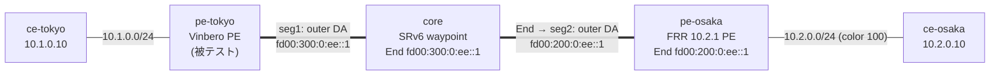

# sr-policy-2site — color ベース SR Policy steering interop (Vinbero ⇄ FRR)

*(English: [README.md](./README.md))*

[l3vpn-2site](../l3vpn-2site/) を拡張し、**color ベースの SR Policy steering** をマルチホップのサービスチェインで検証する [containerlab](https://containerlab.dev/) シナリオです (RFC 9256 / RFC 9252 §8)。動作する 2 拠点 SRv6 L3VPN の上で、FRR が顧客経路に **Color Extended Community** を付与し、**Vinbero**（被テスト）がその colored トラフィックを operator 定義の SR Policy へ steer します。SR Policy は **2 つの transport segment**（core の End と FRR の End）を持ち、FRR の service SID の前に両方を合成します。これによりパケットは core の End、FRR の End、End.DT4 の順に**セグメントを 1 つずつ辿る**実際のサービスチェインになります。制御面 (RFC 9256 best-path、`policy_id` indirection)、`vbctl bgp advertise-sr-policy` による広報、XDP データ面の合成を end-to-end で通します。

## トポロジ



ノード構成は l3vpn-2site と同じです（単一 provider AS 65100、loopback で iBGP）。core は本シナリオでは SRv6 の End 中継点も兼ねます。コンテナ名は `clab-sr-policy-2site-<node>` です。

## steering の仕組み

1. FRR が経路に color を付与します。`frr.conf` の `route-map vpn export SET-COLOR` が `set extcommunity color 100` を `10.2.0.0/24` の VPNv4 export に適用します。BGP next hop は FRR の loopback `2001:db8:ff::2` です。
2. Vinbero が 2 セグメントの local SR Policy を定義します。`vbctl sr-policy create --color 100 --endpoint 2001:db8:ff::2 --segments fd00:300:0:ee::1,fd00:200:0:ee::1` です。endpoint は経路の IPv6 next hop と一致する必要があります。
3. applier が `policy_id` を stamp します。color 100・next hop `2001:db8:ff::2` の `10.2.0.0/24` を受信すると SR Policy に解決し、その `policy_id` を headend エントリに stamp します。
4. XDP が転送時に合成します。headend が FRR の End.DT4 service SID の前に 2 つの transport SID を前置するので、encap 後のパケットは outer DA = `fd00:300:0:ee::1`（core の End）、SRH は `[service, FRR End, core End]` の逆順になります。
5. core が End で次のセグメントへ進めます。`core/start.sh` が `fd00:300:0:ee::1` に `seg6local action End` を設置し、Segments Left を 1 つ減らして outer DA を FRR の End `fd00:200:0:ee::1` に書き換え、pe-osaka へ転送します。
6. FRR が End と End.DT4 で decap します。`frr/start.sh` が `fd00:200:0:ee::1` に End localsid を設置し、service SID `fd00:200:0:1::` へ進めて End.DT4 が `vrf-cust` へ decap し ce-osaka へ届けます。

core の End SID は `fd00:300::/48`、FRR の End と service SID は `fd00:200::/48` にあり、pe-tokyo と core の static route がそれぞれ次ホップへ運びます。

## 実行

Docker・`containerlab`・`sudo` が必要。`examples/interop-clab/` から:

```bash
make all SCENARIO=sr-policy-2site     # build + deploy + test + destroy
```

`make build|deploy|test|destroy SCENARIO=sr-policy-2site` で個別実行、`make status|logs SCENARIO=sr-policy-2site` で BGP/daemon 状態を dump。共有イメージは `../../images/`。

## `test.sh` が検証すること

1. iBGP セッションが ESTABLISHED になります。
2. 2 セグメントの local SR Policy がインストールされます。`vbctl sr-policy list` に `fd00:300:0:ee::1` と `fd00:200:0:ee::1` の両方が出ます。
3. `vbctl bgp advertise-sr-policy` が実機で広報に成功します。これは encode 経路のスモークです。FRR 10.2 は SAFI 73 の受信に非対応なので、受信と decode の interop は gobgp の e2e テストでカバーします。
4. color 経路が policy に解決します。FRR の `10.2.0.0/24`（color 100）が Vinbero の `headend_v4` map に入り、SR Policy に active candidate が付きます。
5. steered チェインのデータ面を確認します。`ce-tokyo → ce-osaka` の ping が通り、tokyo→core では outer DA が core の End `fd00:300:0:ee::1`、core→osaka では FRR の End `fd00:200:0:ee::1` に書き換わります。outer DA がホップごとに変わることが、セグメントを 1 つずつ辿るサービスチェインの証明になります。
6. negative を確認します。color を持たず policy にマッチしない逆方向（`ce-osaka → ce-tokyo`）も通常の L3VPN として転送されます。color steering が無 color トラフィックを壊しません。

pass すると `RESULT: 9 passed, 0 failed` が出ます。

## 注記

- SR Policy の transport list は **Type B (SRv6 SID)** が 2 本です。合成リストは `<core End> ++ <FRR End> ++ <service SID>` です (RFC 9252 §8)。同一 locator 時の末尾 SID 省略最適化は使いません。
- steering は full H.Encaps です。合成した SRH に全 segment を載せます。
- core と FRR の End SID は `seg6local` で直接設置します。End behavior が Segments Left を減らして次の SID へ outer DA を書き換え、パケットをチェインに沿って進めます。
- `advertise-sr-policy` の受信側 interop は本シナリオでは検証できません。FRR 10.2 の BGP は address-family が ipv4 / ipv6 / l2vpn のみで SR Policy (SAFI 73) を受信しないためです。advertise → wire → decode の往復は `pkg/bgp/gobgp` の e2e テストで確認します。
- `l3vpn-2site` 同様、XDP は **generic** モードで attach します。containerlab の veth は native XDP に非対応のためです。`core/`・`frr/`・`vinbero/` の `start.sh` に残りの設定 glue があり、各 inline コメントに説明があります。
