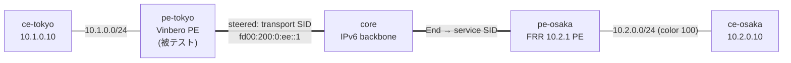

# sr-policy-2site — color ベース SR Policy steering interop (Vinbero ⇄ FRR)

*(English: [README.md](./README.md))*

[l3vpn-2site](../l3vpn-2site/) を拡張し、**color ベースの SR Policy steering** (RFC 9256 / RFC 9252 §8) を検証する [containerlab](https://containerlab.dev/) シナリオ。動作する 2 拠点 SRv6 L3VPN の上で、FRR が顧客経路に **Color Extended Community** を付与し、**Vinbero**（被テスト）がその colored トラフィックを operator 定義の SR Policy へ steer する。具体的には、FRR の **service SID** の前に policy の **transport SID** を合成し、service SID へ直行せず transit hop を経由して転送する。制御面（RFC 9256 best-path、`policy_id` indirection）と XDP データ面の合成を end-to-end で通す。

## トポロジ



ノード構成は l3vpn-2site と同じ（単一 provider AS 65100、loopback で iBGP）。コンテナ名は `clab-sr-policy-2site-<node>`。

## steering の仕組み

1. **FRR が経路に color を付与**: `frr.conf` の `route-map vpn export SET-COLOR` → `set extcommunity color 100` を `10.2.0.0/24` の VPNv4 export に適用。BGP next hop は FRR の loopback `2001:db8:ff::2`。
2. **Vinbero が local SR Policy を定義**: `vbctl sr-policy create --color 100 --endpoint 2001:db8:ff::2 --segments fd00:200:0:ee::1`。endpoint は**経路の IPv6 next hop と一致必須**（一致しないとマッチしない）。
3. **applier が `policy_id` を stamp**: color 100・next hop `2001:db8:ff::2` の `10.2.0.0/24` を受信すると SR Policy に解決し、その `policy_id` を headend エントリに stamp。
4. **XDP が転送時に合成**: headend が FRR の End.DT4 service SID の前に transport SID を前置 → encap 後のパケットは outer DA = `fd00:200:0:ee::1`（transport）、SRH `[service, transport]`。
5. **FRR が transit して decap**: `frr/start.sh` が `fd00:200:0:ee::1` に `seg6local action End` localsid を設置。End が service SID `fd00:200:0:1::` へ進め、そこで FRR の End.DT4 が `vrf-cust` へ decap → ce-osaka。

transport SID は FRR の `fd00:200::/48` ブロック内なので、core の既存 static route がそのまま FRR へ運ぶ。

## 実行

Docker・`containerlab`・`sudo` が必要。`examples/interop-clab/` から:

```bash
make all SCENARIO=sr-policy-2site     # build + deploy + test + destroy
```

`make build|deploy|test|destroy SCENARIO=sr-policy-2site` で個別実行、`make status|logs SCENARIO=sr-policy-2site` で BGP/daemon 状態を dump。共有イメージは `../../images/`。

## `test.sh` が検証すること

1. **iBGP セッション ESTABLISHED**。
2. **local SR Policy がインストール済み** — `vbctl sr-policy list` に transport `fd00:200:0:ee::1` の policy が出る。
3. **color 経路が policy に解決** — FRR の `10.2.0.0/24`（color 100）が Vinbero の `headend_v4` map に入り、SR Policy に active candidate がある。
4. **steered データ面** — `ce-tokyo → ce-osaka` の ping が通り、かつ FRR で捕捉した encap パケットの **outer DA が transport SID** である（非 steered なら service SID 直行）— これが steering の決定的証明。
5. **negative** — color を持たず policy にマッチしない逆方向（`ce-osaka → ce-tokyo`）も通常 L3VPN として転送される。color steering が無 color トラフィックを壊さないこと。

pass すると `RESULT: 7 passed, 0 failed` が出る。

## 注記

- SR Policy の transport list は **Type B (SRv6 SID)** 1 本。合成リストは `<transport> ++ <service SID>`（RFC 9252 §8）。同一 locator 時の末尾 SID 省略最適化は未使用。
- steering は full H.Encaps（合成 SRH に両 segment を載せる）。
- transport End SID は FRR に `seg6local` で直接設置（FRR は BGP で originate しない）。End behavior が transport hop から service SID へパケットを進める。
- `l3vpn-2site` 同様、XDP は **generic** モードで attach（containerlab の veth は native XDP 非対応）。`core/`・`frr/`・`vinbero/` の `start.sh` に残りの設定 glue があり、各 inline コメントに説明あり。
