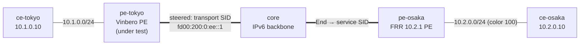

# sr-policy-2site — color-based SR Policy steering interop (Vinbero ⇄ FRR)

*(日本語: [README.ja.md](./README.ja.md))*

A [containerlab](https://containerlab.dev/) scenario that extends
[l3vpn-2site](../l3vpn-2site/) with **color-based SR Policy steering**
(RFC 9256 / RFC 9252 §8). On top of the working 2-site SRv6 L3VPN, FRR tags
its customer route with a **Color Extended Community**, and **Vinbero**
(under test) steers that colored traffic onto an operator-defined SR Policy:
it composes the policy's **transport** SID ahead of FRR's **service** SID and
forwards through a transit hop, instead of sending straight to the service
SID. The control plane (RFC 9256 best-path, `policy_id` indirection) and the
XDP data-plane composition are exercised end to end.

## Topology



Same 5 nodes as l3vpn-2site (one provider AS 65100, iBGP on loopbacks).
Containers are named `clab-sr-policy-2site-<node>`.

## How the steering works

1. **FRR colors its route.** `frr.conf` applies `route-map vpn export
   SET-COLOR` → `set extcommunity color 100` to the `10.2.0.0/24` VPNv4
   export. The BGP next hop is FRR's loopback `2001:db8:ff::2`.
2. **Vinbero defines a local SR Policy.** `vbctl sr-policy create --color
   100 --endpoint 2001:db8:ff::2 --segments fd00:200:0:ee::1`. The endpoint
   **must equal the route's IPv6 next hop** for the match to land.
3. **The applier stamps `policy_id`.** Receiving `10.2.0.0/24` with color
   100 and next hop `2001:db8:ff::2`, Vinbero resolves it to the SR Policy
   and stamps the policy's `policy_id` on the headend entry.
4. **XDP composes at forward time.** The headend prepends the transport SID
   ahead of FRR's End.DT4 service SID, so the encapsulated packet is:
   outer DA = `fd00:200:0:ee::1` (transport), SRH `[service, transport]`.
5. **FRR transits and decaps.** `frr/start.sh` installs a `seg6local action
   End` localsid at `fd00:200:0:ee::1`; End advances to the service SID
   `fd00:200:0:1::`, where FRR's End.DT4 decaps into `vrf-cust` → ce-osaka.

The transport SID sits inside FRR's `fd00:200::/48` block so the core's
existing static route carries it to FRR.

## Run

Needs Docker, `containerlab`, and `sudo`. From `examples/interop-clab/`:

```bash
make all SCENARIO=sr-policy-2site     # build + deploy + test + destroy
```

`make build|deploy|test|destroy SCENARIO=sr-policy-2site` run the steps
individually; `make status|logs SCENARIO=sr-policy-2site` dump BGP/daemon
state. Shared images live in `../../images/`.

## What `test.sh` checks

1. **iBGP session ESTABLISHED.**
2. **Local SR Policy installed** — `vbctl sr-policy list` shows the policy
   with transport `fd00:200:0:ee::1`.
3. **Color route resolves onto the policy** — FRR's `10.2.0.0/24` (color
   100) lands in Vinbero's `headend_v4` map and the SR Policy has an active
   candidate.
4. **Steered data plane** — `ce-tokyo → ce-osaka` pings, AND the
   encapsulated packet captured at FRR carries the **transport SID as its
   outer destination** (a non-steered packet would go straight to the
   service SID) — the definitive steering proof.
5. **Negative** — the return direction (`ce-osaka → ce-tokyo`), which carries
   no color and matches no policy, still forwards as a plain L3VPN: color
   steering must not break un-colored traffic.

A pass prints `RESULT: 7 passed, 0 failed`.

## Notes

- The SR Policy's transport list is a single **Type B (SRv6 SID)** segment.
  The composed list is `<transport> ++ <service SID>` (RFC 9252 §8); the
  last-SID-omission optimization (when both share a locator) is not used.
- Steering uses full H.Encaps (the composed SRH carries both segments).
- The transport End SID is installed on FRR with `seg6local` directly
  (FRR does not originate it via BGP); the End behavior advances the packet
  from the transport hop to the service SID.
- Like `l3vpn-2site`, XDP attaches in **generic** mode (containerlab veth
  has no native XDP); the `core/`, `frr/`, `vinbero/` `start.sh` scripts
  carry the remaining setup glue, documented in their inline comments.
