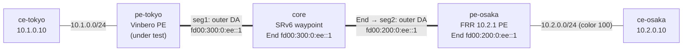

# sr-policy-2site — color-based SR Policy steering interop (Vinbero ⇄ FRR)

*(日本語: [README.ja.md](./README.ja.md))*

A [containerlab](https://containerlab.dev/) scenario that extends
[l3vpn-2site](../l3vpn-2site/) with **color-based SR Policy steering** over a
multi-hop service chain (RFC 9256 / RFC 9252 §8). On top of the working
2-site SRv6 L3VPN, FRR tags its customer route with a **Color Extended
Community**, and **Vinbero** (under test) steers that colored traffic onto an
operator-defined SR Policy. The policy carries **two transport segments**
(an End on the core node, then an End on FRR), both composed ahead of FRR's
service SID, so the packet walks the segments one by one — core End, FRR
End, then End.DT4 — a real service chain rather than a single egress detour.
The control plane (RFC 9256 best-path, `policy_id` indirection), the
`vbctl bgp advertise-sr-policy` advertise direction, and the XDP data-plane
composition are exercised end to end.

## Topology



Same 5 nodes as l3vpn-2site (one provider AS 65100, iBGP on loopbacks); here
the core doubles as an SRv6 End waypoint. Containers are named
`clab-sr-policy-2site-<node>`.

## How the steering works

1. **FRR colors its route.** `frr.conf` applies `route-map vpn export
   SET-COLOR` → `set extcommunity color 100` to the `10.2.0.0/24` VPNv4
   export. The BGP next hop is FRR's loopback `2001:db8:ff::2`.
2. **Vinbero defines a two-segment local SR Policy.** `vbctl sr-policy create
   --color 100 --endpoint 2001:db8:ff::2 --segments
   fd00:300:0:ee::1,fd00:200:0:ee::1`. The endpoint must equal the route's
   IPv6 next hop for the match to land.
3. **The applier stamps `policy_id`.** Receiving `10.2.0.0/24` with color
   100 and next hop `2001:db8:ff::2`, Vinbero resolves it to the SR Policy
   and stamps the policy's `policy_id` on the headend entry.
4. **XDP composes at forward time.** The headend prepends both transport SIDs
   ahead of FRR's End.DT4 service SID, so the encapsulated packet leaves with
   outer DA = `fd00:300:0:ee::1` (core's End) and an SRH of
   `[service, FRR End, core End]` (wire-reverse order).
5. **Core advances the chain.** `core/start.sh` installs a `seg6local action
   End` localsid at `fd00:300:0:ee::1`; End decrements Segments Left, rewrites
   the outer DA to FRR's End `fd00:200:0:ee::1`, and forwards to pe-osaka.
6. **FRR transits and decaps.** `frr/start.sh` installs an End localsid at
   `fd00:200:0:ee::1`; it advances to the service SID `fd00:200:0:1::`, where
   FRR's End.DT4 decaps into `vrf-cust` → ce-osaka.

The core End SID is in `fd00:300::/48`; FRR's End and service SID are in
`fd00:200::/48`. The pe-tokyo and core static routes carry each to its next
hop.

## Run

Needs Docker, `containerlab`, and `sudo`. From `examples/interop-clab/`:

```bash
make all SCENARIO=sr-policy-2site     # build + deploy + test + destroy
```

`make build|deploy|test|destroy SCENARIO=sr-policy-2site` run the steps
individually; `make status|logs SCENARIO=sr-policy-2site` dump BGP/daemon
state. Shared images live in `../../images/`.

## What `test.sh` checks

1. iBGP session ESTABLISHED.
2. The two-segment local SR Policy is installed — `vbctl sr-policy list`
   shows both `fd00:300:0:ee::1` and `fd00:200:0:ee::1`.
3. `vbctl bgp advertise-sr-policy` advertises the policy in a live
   deployment (an encode-path smoke). FRR 10.2 does not receive SAFI 73, so
   the receive/decode interop is covered by the gobgp e2e tests.
4. The color route resolves onto the policy — FRR's `10.2.0.0/24` (color
   100) lands in Vinbero's `headend_v4` map and the SR Policy has an active
   candidate.
5. The steered chain data plane — `ce-tokyo → ce-osaka` pings, and the outer
   destination changes per hop: `fd00:300:0:ee::1` (core's End) on the
   tokyo→core link, then `fd00:200:0:ee::1` (FRR's End) on the core→osaka
   link. The outer DA changing hop by hop is the proof of a real
   segment-by-segment service chain.
6. Negative — the return direction (`ce-osaka → ce-tokyo`), which carries no
   color and matches no policy, still forwards as a plain L3VPN: color
   steering must not break un-colored traffic.

A pass prints `RESULT: 9 passed, 0 failed`.

## Notes

- The SR Policy's transport list is two **Type B (SRv6 SID)** segments. The
  composed list is `<core End> ++ <FRR End> ++ <service SID>` (RFC 9252 §8);
  the last-SID-omission optimization (when segments share a locator) is not
  used.
- Steering uses full H.Encaps (the composed SRH carries every segment).
- Both the core and FRR End SIDs are installed with `seg6local` directly. The
  End behavior decrements Segments Left, rewrites the outer DA to the next
  SID, and walks the packet along the chain.
- The advertise direction is not verified against FRR here: FRR 10.2's BGP
  only has the ipv4 / ipv6 / l2vpn address families and does not receive SR
  Policy (SAFI 73). The advertise → wire → decode round trip is covered by
  the `pkg/bgp/gobgp` e2e tests.
- Like `l3vpn-2site`, XDP attaches in **generic** mode (containerlab veth
  has no native XDP); the `core/`, `frr/`, `vinbero/` `start.sh` scripts
  carry the remaining setup glue, documented in their inline comments.
