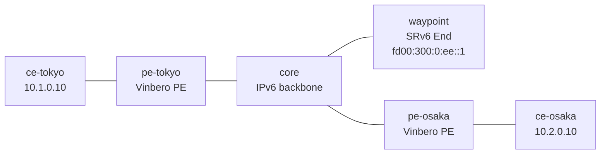

# sr-policy-bgp-2site — edge 同士の SR Policy 交換と TE (Vinbero ⇄ Vinbero)

*(English: [README.md](./README.md))*

両 edge が Vinbero の PE で、BGP (SAFI 73) で SR Policy を互いに交換し合い、共有の TE waypoint を経由して L3VPN 通信する [containerlab](https://containerlab.dev/) シナリオです。SR Policy を operator がローカル定義する [sr-policy-2site](../sr-policy-2site/) と違い、ここでは各 PE が自分宛の SR Policy を広報し、相手 PE がそれを受信 (origin BGP) して steering します。受信・デコード経路と、edge 同士の双方向 TE を実 BGP セッションで通します。

separate な controller (srctl) や FRR は使いません。2 つの edge が VPN 経路も SR Policy も自分たちで交換します。

## トポロジ



両 PE は AS 65100 で loopback 越しに iBGP を張り、1 つのセッションで VPNv4/VPNv6 (L3VPN) と SR Policy (SAFI 73) を運びます。core は plain な IPv6 router、waypoint は SRv6 End ノード (iproute2 seg6local) です。コンテナ名は `clab-sr-policy-bgp-2site-<node>` です。

## 仕組み

1. 各 PE が自分の顧客 prefix を color 100 付きの VPN 経路として広報します。next hop は自分の loopback です。
2. 各 PE が自分宛の SR Policy を広報します。`{color 100, endpoint = 自分の loopback, segments = [waypoint End SID]}` です。
3. 相手 PE が両方を受信します。color 付き経路 (next hop = 相手 loopback) と、同じ {color, endpoint} を持つ SR Policy (origin BGP) が揃い、経路が policy に解決して `policy_id` が headend エントリに stamp されます。
4. 転送時、headend が waypoint End SID を service SID の前に合成します。outer DA は waypoint End SID になり、パケットは core から waypoint へ寄り道してから相手 PE の service SID へ向かいます。
5. waypoint の End が Segments Left を減らして次の SID (service SID) へ DA を書き換え、core 経由で相手 PE へ送ります。相手 PE の End.DT4 が `vrf-cust` へ decap します。

両方向とも最短路 (pe-tokyo ↔ core ↔ pe-osaka) ではなく waypoint を経由するので、BGP で配った SR Policy による SR-TE 経路を通ります。

## 実行

Docker・`containerlab`・`sudo` が必要です。`examples/interop-clab/` から実行します。

```bash
make all SCENARIO=sr-policy-bgp-2site
```

`make build|deploy|test|destroy SCENARIO=sr-policy-bgp-2site` で個別実行、`make status|logs SCENARIO=sr-policy-bgp-2site` で状態を確認できます。

## `test.sh` が検証すること

1. SR Policy が edge 同士で交換されます。pe-tokyo は pe-osaka の SR Policy を、pe-osaka は pe-tokyo の SR Policy を、それぞれ origin bgp・transport = waypoint End SID で学習します。
2. color 経路が学習済み policy に解決します。各 PE の `headend_v4` map に相手の prefix が入り、policy に active candidate が付きます。
3. データ面が双方向で TE されます。`ce-tokyo ↔ ce-osaka` の ping が両方向通り、waypoint との link で捕捉したパケットの outer DA が waypoint End SID になります。これが SR-TE で waypoint を経由している証明です。

pass すると `RESULT: 8 passed, 0 failed` が出ます。

## 注記

- 両 PE が Vinbero なので、color 付き VPN 経路の広報には `vbctl bgp advertise-vpn --color` を使います。受信側はその color を見て steering します。
- waypoint の End SID は両方向で共有する 1 つの TE 経由点です。segment list は両 PE とも `[fd00:300:0:ee::1]` で、service SID は転送時に合成されます。
- controller を第三者実装に替える場合は、SR Policy を話せる実装 (Cisco IOS XR / Nokia SR OS / GoBGP) を peer に置けます。FRR は SR Policy SAFI 73 非対応なので使えません。
- `l3vpn-2site` 同様、XDP は generic モードで attach します。各 `start.sh` に設定の詳細を inline コメントで記しています。
