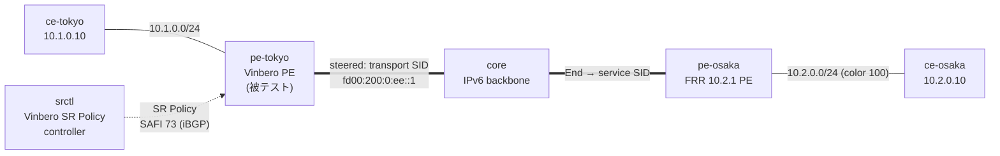

# sr-policy-bgp-2site — BGP 学習 SR Policy の interop (Vinbero ⇄ Vinbero ⇄ FRR)

*(English: [README.md](./README.md))*

[sr-policy-2site](../sr-policy-2site/) と同じ color ベースの SR Policy steering を、SR Policy を BGP (SAFI 73) で学習する形で検証する [containerlab](https://containerlab.dev/) シナリオです。sr-policy-2site では SR Policy を PE にローカル定義しますが、本シナリオでは別の controller (srctl) が SR Policy を BGP で広報し、被テストの Vinbero PE がそれを受信 (origin BGP) して steering します。これにより、ローカル定義版ではカバーできない SR Policy の受信・デコード経路を実 BGP セッションで通せます。

controller は現状 Vinbero ですが、将来 Cisco IOS XR (XRd) や Nokia SR OS、GoBGP などの SR Policy 実装に差し替えられます。FRR は SR Policy SAFI 73 に非対応なので controller には使えません。

## トポロジ



ノードは sr-policy-2site の 5 台に controller srctl を加えた 6 台です。pe-tokyo は AS 65100 で 2 つの iBGP セッションを張ります。FRR とは loopback 越しに VPNv4/VPNv6、srctl とは直結リンク越しに SR Policy (SAFI 73) です。コンテナ名は `clab-sr-policy-bgp-2site-<node>` です。

## 仕組み

1. srctl が SR Policy を BGP で広報します。`vbctl bgp advertise-sr-policy --color 100 --endpoint 2001:db8:ff::2 --segments fd00:200:0:ee::1 --distinguisher 1 --next-hop 2001:db8:cc::2` を起動時に実行します。
2. pe-tokyo が SR Policy を受信します。SAFI 73 セッションで NLRI と Tunnel Encapsulation 属性をデコードし、origin BGP として SR Policy テーブルに格納します。`vbctl sr-policy list` に origin が bgp で出ます。
3. FRR が経路に color を付与します。`10.2.0.0/24` の VPNv4 export に color 100 を付け、BGP next hop は FRR の loopback `2001:db8:ff::2` です。
4. applier が経路を policy に解決します。color 100・next hop が一致する経路を BGP 学習済みの SR Policy に解決し、その `policy_id` を headend エントリに stamp します。
5. XDP が転送時に合成します。FRR の End.DT4 service SID の前に transport SID を前置するので、encap 後の outer DA は `fd00:200:0:ee::1` になります。FRR の End が service SID へ進め、End.DT4 が `vrf-cust` へ decap して ce-osaka へ届けます。

## 実行

Docker・`containerlab`・`sudo` が必要です。`examples/interop-clab/` から実行します。

```bash
make all SCENARIO=sr-policy-bgp-2site
```

`make build|deploy|test|destroy SCENARIO=sr-policy-bgp-2site` で個別実行、`make status|logs SCENARIO=sr-policy-bgp-2site` で状態を確認できます。共有イメージは `../../images/` にあります。

## `test.sh` が検証すること

1. FRR との iBGP VPN セッションが ESTABLISHED になります。
2. PE が SR Policy を BGP で学習します。`vbctl sr-policy list` に origin bgp の policy が出ることで、SAFI 73 セッションと NLRI・Tunnel Encap のデコードを確認します。
3. FRR の color-100 経路が BGP 学習済みの policy に解決します。`headend_v4` map に `10.2.0.0/24` が入り、policy に active candidate が付きます。
4. steered データ面を確認します。`ce-tokyo → ce-osaka` の ping が通り、FRR で捕捉した encap パケットの outer DA が transport SID `fd00:200:0:ee::1` になります。
5. negative を確認します。color を持たない逆方向 (`ce-osaka → ce-tokyo`) も通常 L3VPN として転送されます。

pass すると `RESULT: 7 passed, 0 failed` が出ます。

## 注記

- 本シナリオは SR Policy の受信・デコード経路を検証します。広報側 (encode) は srctl が担い、被テストの PE は受信して steering します。
- sr-policy-2site との違いは SR Policy の出所だけです。あちらは PE のローカル定義、こちらは BGP 学習です。データ面の合成と steering の仕組みは同じです。
- controller を第三者実装に差し替える場合、srctl ノードを Cisco XRd や Nokia SR OS、GoBGP に置き換え、同じ {color, endpoint, transport} の SR Policy を広報させます。FRR は SAFI 73 非対応なので controller にはなれません。
- `l3vpn-2site` 同様、XDP は generic モードで attach します。各 `start.sh` に設定の詳細を inline コメントで記しています。
