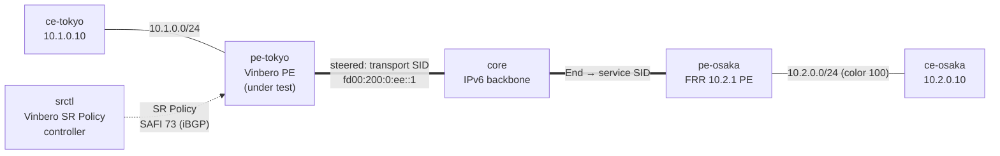

# sr-policy-bgp-2site — BGP-learned SR Policy interop (Vinbero ⇄ Vinbero ⇄ FRR)

*(日本語: [README.ja.md](./README.ja.md))*

A [containerlab](https://containerlab.dev/) scenario that runs the same
color-based SR Policy steering as [sr-policy-2site](../sr-policy-2site/), but
the SR Policy is **learned over BGP (SAFI 73)** instead of being defined
locally on the PE. A separate controller (srctl) advertises the SR Policy
over BGP and the Vinbero PE under test receives it (origin BGP) and steers on
it. This exercises Vinbero's SR Policy receive/decode path over a real BGP
session, complementing sr-policy-2site (which covers the local-definition
path).

The controller is Vinbero today and can be swapped for a third-party SR
Policy speaker (Cisco IOS XR / XRd, Nokia SR OS, GoBGP) later. FRR cannot be
the controller: its BGP does not implement SR Policy (SAFI 73).

## Topology



The five sr-policy-2site nodes plus the controller srctl, six in total.
pe-tokyo runs two iBGP sessions in AS 65100: VPNv4/VPNv6 with FRR over the
loopbacks, and SR Policy (SAFI 73) with srctl over a direct link. Containers
are named `clab-sr-policy-bgp-2site-<node>`.

## How it works

1. srctl advertises the SR Policy over BGP. At start-up it runs `vbctl bgp
   advertise-sr-policy --color 100 --endpoint 2001:db8:ff::2 --segments
   fd00:200:0:ee::1 --distinguisher 1 --next-hop 2001:db8:cc::2`.
2. pe-tokyo receives the SR Policy. The SAFI 73 session decodes the NLRI and
   Tunnel Encapsulation attribute and stores the policy with origin BGP;
   `vbctl sr-policy list` shows origin bgp.
3. FRR colors its route. The `10.2.0.0/24` VPNv4 export carries color 100 and
   a BGP next hop of FRR's loopback `2001:db8:ff::2`.
4. The applier resolves the route onto the policy. A color-100 route whose
   next hop matches the BGP-learned policy's endpoint gets the policy's
   `policy_id` stamped on its headend entry.
5. XDP composes at forward time. The transport SID is prepended ahead of
   FRR's End.DT4 service SID, so the encapsulated packet leaves with outer
   DA = `fd00:200:0:ee::1`; FRR's End advances to the service SID and End.DT4
   decaps into `vrf-cust` → ce-osaka.

## Run

Needs Docker, `containerlab`, and `sudo`. From `examples/interop-clab/`:

```bash
make all SCENARIO=sr-policy-bgp-2site
```

`make build|deploy|test|destroy SCENARIO=sr-policy-bgp-2site` run the steps
individually; `make status|logs SCENARIO=sr-policy-bgp-2site` dump state.
Shared images live in `../../images/`.

## What `test.sh` checks

1. The iBGP VPN session with FRR is ESTABLISHED.
2. The PE learned the SR Policy over BGP — `vbctl sr-policy list` shows it
   with origin bgp, proving the SAFI 73 session and the decode of the SR
   Policy NLRI and Tunnel Encapsulation attribute.
3. FRR's color-100 route resolves onto the BGP-learned policy — `10.2.0.0/24`
   lands in the `headend_v4` map and the policy has an active candidate.
4. The steered data plane — `ce-tokyo → ce-osaka` pings, and the encapsulated
   packet captured at FRR carries the transport SID `fd00:200:0:ee::1` as its
   outer destination.
5. Negative — the un-colored return direction (`ce-osaka → ce-tokyo`) still
   forwards as plain L3VPN.

A pass prints `RESULT: 7 passed, 0 failed`.

## Notes

- This scenario validates the SR Policy receive/decode path. The advertise
  (encode) side is driven by srctl; the PE under test receives and steers.
- The only difference from sr-policy-2site is where the SR Policy comes from:
  there it is defined locally on the PE, here it is learned over BGP. The
  data-plane composition and steering are identical.
- To use a third-party controller, replace the srctl node with Cisco XRd,
  Nokia SR OS, or GoBGP advertising the same {color, endpoint, transport} SR
  Policy. FRR cannot be the controller because it does not implement SAFI 73.
- Like `l3vpn-2site`, XDP attaches in generic mode; each `start.sh` documents
  the remaining setup glue in inline comments.
