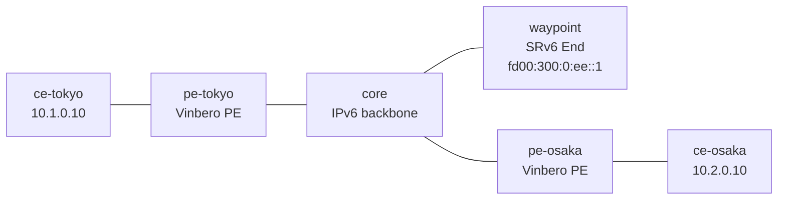

# sr-policy-bgp-2site — edge-to-edge SR Policy exchange + TE (Vinbero ⇄ Vinbero)

*(日本語: [README.ja.md](./README.ja.md))*

A [containerlab](https://containerlab.dev/) scenario where both edges are
Vinbero PEs that exchange SR Policies with each other over BGP (SAFI 73) and
steer their L3VPN traffic through a shared TE waypoint. Unlike
[sr-policy-2site](../sr-policy-2site/), where the operator defines the SR
Policy locally, here each PE advertises an SR Policy for reaching itself and
the peer receives it (origin BGP) and steers on it. This exercises the SR
Policy receive/decode path and bidirectional edge-to-edge SR-TE over a real
BGP session.

There is no separate controller (srctl) and no FRR: the two edges exchange
both the VPN routes and the SR Policies themselves.

## Topology



Both PEs are in one provider AS (65100) and peer iBGP over their loopbacks,
carrying VPNv4/VPNv6 (L3VPN) and SR Policy (SAFI 73) on one session. `core`
is a plain IPv6 router and `waypoint` is an SRv6 End node (iproute2
seg6local). Containers are named `clab-sr-policy-bgp-2site-<node>`.

## How it works

1. Each PE advertises its own customer subnet as a color-100 VPN route, with
   the next hop set to its own loopback.
2. Each PE advertises an SR Policy for reaching itself: `{color 100,
   endpoint = own loopback, segments = [waypoint End SID]}`.
3. The peer receives both. The colored route (next hop = peer loopback) and
   the SR Policy with the matching {color, endpoint} (origin BGP) line up, so
   the route resolves onto the policy and its `policy_id` is stamped on the
   headend entry.
4. At forward time the headend composes the waypoint End SID ahead of the
   service SID, so the outer destination is the waypoint End SID and the
   packet detours through the waypoint before reaching the peer's service SID.
5. The waypoint's End decrements Segments Left, rewrites the DA to the next
   SID (the service SID), and sends it on via the core. The peer's End.DT4
   decaps into `vrf-cust`.

Both directions traverse the waypoint instead of the shortest path
(pe-tokyo <-> core <-> pe-osaka), so they follow the SR-TE path signaled over
BGP.

## Run

Needs Docker, `containerlab`, and `sudo`. From `examples/interop-clab/`:

```bash
make all SCENARIO=sr-policy-bgp-2site
```

`make build|deploy|test|destroy SCENARIO=sr-policy-bgp-2site` run the steps
individually; `make status|logs SCENARIO=sr-policy-bgp-2site` dump state.

## What `test.sh` checks

1. SR Policies are exchanged edge-to-edge: pe-tokyo learns pe-osaka's SR
   Policy and pe-osaka learns pe-tokyo's, each origin bgp with the waypoint
   End SID as its transport segment.
2. The color routes resolve onto the learned policies: each PE's `headend_v4`
   map holds the peer's prefix and the policy has an active candidate.
3. The data plane is steered both ways: `ce-tokyo <-> ce-osaka` pings in both
   directions, and the packets captured on the core<->waypoint link carry the
   waypoint End SID as their outer destination -- the SR-TE detour.

A pass prints `RESULT: 8 passed, 0 failed`.

## Notes

- Because both PEs are Vinbero, colored VPN routes are advertised with
  `vbctl bgp advertise-vpn --color`; the receiving side steers on that color.
- The waypoint End SID is a single shared TE waypoint for both directions.
  Both PEs use the segment list `[fd00:300:0:ee::1]`; the service SID is
  composed at forward time.
- To use a third-party controller, peer with an implementation that speaks SR
  Policy (Cisco IOS XR / Nokia SR OS / GoBGP). FRR cannot be used: it does not
  implement SR Policy (SAFI 73).
- Like `l3vpn-2site`, XDP attaches in generic mode; each `start.sh` documents
  the remaining setup glue in inline comments.
