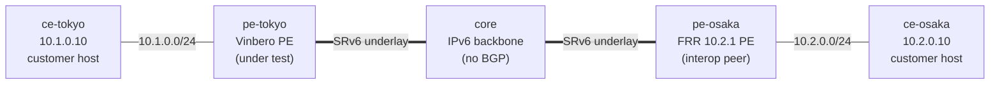

# usid-l3vpn-2site — uSID による 2 拠点 SRv6 L3VPN (Vinbero ⇄ FRR)

*(English: [README.md](./README.md))*

[`l3vpn-2site`](../l3vpn-2site/) の uSID (NEXT-C-SID F3216、RFC 9800) 版で、両 PE が uSID locator を使う。FRR は `format usid-f3216`、Vinbero は `--behavior usid` の locator を持つ。検証するのは制御プレーンとデータプレーンの両方で、制御プレーンでは RFC 9252 の SID Structure 32/16/16/0 を載せた micro-SID VPN 経路の交換 (FRR は usid-f3216 でも function uSID を VPN label に転置するので、Vinbero が畳み戻す) と、Vinbero が uSID 形状を認識して経路を H.Encaps.Red で設置することを確認する。データプレーンでは双方向の実 `ping` に加え、Vinbero → FRR 方向の wire に SRH が無いこと (単一 uSID の reduced encapsulation は素の IPv4-in-IPv6 になる) を tcpdump でアサートする。

## トポロジ



| ノード                  | 役割                                                   |
|-------------------------|--------------------------------------------------------|
| `ce-tokyo` / `ce-osaka` | 顧客ホスト — `10.1.0.10` / `10.2.0.10`。                |
| `pe-tokyo`              | テスト対象の Vinbero PE（`vinberod --bgp-enabled`、XDP）。|
| `pe-osaka`              | FRR 10.2.1 PE（interop 相手）。                         |
| `core`                  | プロバイダ backbone — 素の IPv6 ルータ、静的経路。      |

コンテナ名は `clab-usid-l3vpn-2site-<node>`。

## 設計

- **iBGP・単一プロバイダ AS (65100)。** 両 PE は loopback (`2001:db8:ff::1` / `::2`) 同士で iBGP（VPNv4 + VPNv6）をピアする — 教科書どおりの L3VPN モデル。iBGP は元々マルチホップ対応なので `ebgp-multihop` 不要。`core` は BGP に関与せず、IPv6 underlay を静的経路でルーティングするのみ（IGP なし＝収束レースなし）。
- **アドレッシング。** underlay `2001:db8:1::/64`・`2001:db8:2::/64`、uSID locator は `fd00:100:1::/48`（Vinbero、node uSID 0x0001）/ `fd00:200:2::/48`（FRR、node uSID 0x0002）で、いずれも F3216（block 32 / node 16 / function 16）。顧客 subnet は `10.1.0.0/24` / `10.2.0.0/24`（両者とも単一 VRF）。
- **データプレーン。** 各 PE は顧客トラフィックを対向 PE の service SID 向けに encap し、戻り方向用に End.DT4 decap を持つ。コアは外側 IPv6 ヘッダのみで転送。Vinbero は両ポートに XDP を attach（eth2 = encap、eth1 = End.DT4 decap）。

コンテナイメージは interop-clab ライブラリ共有で `../../images/` にある。

## 実行

Docker・`containerlab`・`sudo` が必要。`examples/interop-clab/` から:

```bash
make all SCENARIO=usid-l3vpn-2site   # build + deploy + test + destroy
```

`make build` / `deploy` / `test` / `destroy` は各ステップを個別に実行、`make status` / `logs` は BGP・デーモンの状態をダンプする。このシナリオは `SCENARIO=usid-l3vpn-2site` の明示が必要になる。

## test.sh が検証する内容

1. **iBGP セッション ESTABLISHED** — 両側。
2. **FRR → Vinbero (decode)** — FRR の `10.2.0.0/24` uSID VPN 経路が Vinbero の `headend_v4` map に設置される。転置された label からフル micro-SID `fd00:200:2:1::` が畳み戻され、SID Structure が uSID 形状なので H.Encaps.Red で設置される。
3. **Vinbero → FRR (encode)** — Vinbero が広告した `10.1.0.0/24` が FRR の VPN RIB に micro-SID `fd00:100:1:1::` 付きで届き、`vrf-cust` に設置される。さらに route refresh 中の BGP capture で、UPDATE が SID Structure Sub-Sub-TLV 32/16/16/0 を運ぶことを wire 上で確認する (FRR は structure の有無に関わらず経路を受理するため、wire でしか検証できない)。
4. **データプレーン** — `ping` が双方向成功し、FRR PE のコア側リンクの tcpdump で Vinbero → FRR 方向に SRH が無いこと (reduced encapsulation) を確認する。

データプレーンは非同期に収束する（XDP attach、BGP 収束、FRR の `seg6` localsid、NDP）ため、section 4 は ping 前に全 readiness 条件を gate する — 収束が遅くても誤った `FAIL` は生じない。成功時は `RESULT: 13 passed, 0 failed` を出力する。

## 注記

- **FRR は固定** — `quay.io/frrouting/frr:10.2.1`。SRv6 L3VPN 構文はバージョン依存が大きいので、更新は `frr.conf` のレビューとセットで。
- **FRR は usid-f3216 でも転置する** — wire 上の SID は bare な block+node `fd00:200:2::` で、function uSID は VPN label に載る。Vinbero のデコーダがこれを `fd00:200:2:1::` に畳み戻す。したがって uSID の判定材料は SID Structure の形状 (32/16/16/0) であって、転置の有無ではない。
- **uSID locator の node CSID は非零が必要** — `fd00:100::/48` ではなく `fd00:100:1::/48` を使うのはこのため。0x0000 は container の終端記号で、FRR も Vinbero も uSID モードでは拒否する。
- XDP は **generic** モードで attach — containerlab の veth は native XDP に非対応。
- `core/`・`frr/`・`vinbero/` の `start.sh` と `frr/frr.conf` が残りのセットアップ（VRF 作成順、source locator 登録、loopback ソースの iBGP、FRR が SRv6 nexthop validation に使う static の `fd00:100:1::/48` 経路は `frr.conf` 側、`net.vrf.strict_mode`）を担う — 詳細は各ファイルのインラインコメント参照。
