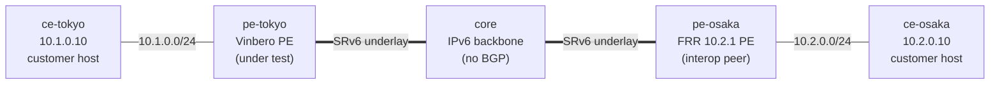

# usid-l3vpn-2site — 2-site SRv6 L3VPN over uSID (Vinbero ⇄ FRR)

*(日本語: [README.ja.md](./README.ja.md))*

The uSID (NEXT-C-SID F3216, RFC 9800) variant of
[`l3vpn-2site`](../l3vpn-2site/): both PEs use uSID locators — FRR with
`format usid-f3216`, Vinbero with a `--behavior usid` locator. It
verifies the **control plane** — micro-SID VPN routes carrying the RFC
9252 SID Structure 32/16/16/0 (FRR still transposes the function uSID
into the VPN label; Vinbero folds it back), and Vinbero recognizing the
uSID shape to install the route with **H.Encaps.Red** — and the **data
plane** — a real bidirectional `ping`, plus a tcpdump assertion that the
Vinbero → FRR direction carries **no SRH on the wire** (a single uSID
under reduced encapsulation is plain IPv4-in-IPv6).

## Topology



| Node                    | Role                                                   |
|-------------------------|--------------------------------------------------------|
| `ce-tokyo` / `ce-osaka` | Customer hosts — `10.1.0.10` / `10.2.0.10`.            |
| `pe-tokyo`              | Vinbero PE under test (`vinberod --bgp-enabled`, XDP). |
| `pe-osaka`              | FRR 10.2.1 PE (interop peer).                          |
| `core`                  | Provider backbone — plain IPv6 router, static routes.  |

Containers are named `clab-usid-l3vpn-2site-<node>`.

## Design

- **iBGP, one provider AS (65100).** Both PEs peer iBGP (VPNv4 + VPNv6)
  on their loopbacks (`2001:db8:ff::1` / `::2`) — the textbook L3VPN
  model. iBGP is naturally multi-hop, so no `ebgp-multihop`. `core` is
  not in BGP; it only routes the IPv6 underlay with static routes (no
  IGP, hence no convergence race).
- **Addressing.** Underlay `2001:db8:1::/64` & `2001:db8:2::/64`;
  uSID locators `fd00:100:1::/48` (Vinbero, node uSID 0x0001) /
  `fd00:200:2::/48` (FRR, node uSID 0x0002), both F3216
  (block 32 / node 16 / function 16);
  customer subnets `10.1.0.0/24` / `10.2.0.0/24`, both in one VRF.
- **Data plane.** Each PE H.Encaps customer traffic toward the far PE's
  service SID and runs an End.DT4 decap for the return direction; the
  core forwards purely by the outer IPv6 header. Vinbero attaches XDP on
  both ports (eth2 = H.Encaps, eth1 = End.DT4 decap).

Container images are shared across the interop-clab library in
`../../images/`.

## Run

Needs Docker, `containerlab` and `sudo`. From `examples/interop-clab/`:

```bash
make all SCENARIO=usid-l3vpn-2site   # build + deploy + test + destroy
```

`make build` / `deploy` / `test` / `destroy` run the steps individually;
`make status` / `logs` dump BGP and daemon state. Name this scenario
explicitly: `make all SCENARIO=usid-l3vpn-2site`.

## What `test.sh` checks

1. **iBGP session ESTABLISHED** — both sides.
2. **FRR → Vinbero (decode)** — FRR's `10.2.0.0/24` uSID VPN route lands
   in Vinbero's `headend_v4` map with the full micro-SID `fd00:200:2:1::`
   folded back from the transposed label, and — because the SID Structure
   is uSID-shaped — installed with **H.Encaps.Red**.
3. **Vinbero → FRR (encode)** — Vinbero's advertised `10.1.0.0/24`
   reaches FRR's VPN RIB with the micro-SID `fd00:100:1:1::` intact and
   installs into `vrf-cust`; a BGP capture during a route-refresh proves
   the UPDATE carries the SID Structure Sub-Sub-TLV `32/16/16/0` (FRR
   accepts the route either way, so only the wire shows it).
4. **Data plane** — `ping` succeeds both ways, and a tcpdump on the FRR
   PE's core-facing link proves the Vinbero → FRR direction carries no
   SRH (reduced encapsulation).

The data plane settles asynchronously (XDP attach, BGP convergence, FRR
`seg6` localsid, NDP), so section 4 gates on every readiness
precondition before pinging — a slow settle cannot cause a spurious
`FAIL`. A pass prints `RESULT: 13 passed, 0 failed`.

## Notes

- **FRR is pinned** to `quay.io/frrouting/frr:10.2.1` — its SRv6 L3VPN
  syntax is version-sensitive; bump only with a `frr.conf` review.
- **FRR transposes even with usid-f3216** — the on-wire SID is the bare
  block+node `fd00:200:2::` with the function uSID in the VPN label;
  Vinbero's decoder folds it back to `fd00:200:2:1::`. The uSID marker
  is therefore the SID Structure shape (32/16/16/0), not the absence of
  transposition.
- **A uSID locator needs a non-zero node CSID** — hence
  `fd00:100:1::/48` rather than `fd00:100::/48` (0x0000 is the container
  terminator and both FRR and Vinbero refuse it in uSID mode).
- XDP attaches in **generic** mode — containerlab veth links have no
  native XDP.
- The `core/`, `frr/` and `vinbero/` `start.sh` scripts and `frr/frr.conf`
  carry the remaining setup glue — VRF creation order, source-locator
  registration, loopback-sourced iBGP, the static `fd00:100:1::/48` route
  (in `frr.conf`) that FRR validates the SRv6 service SID against,
  `net.vrf.strict_mode` — documented in their inline comments.
