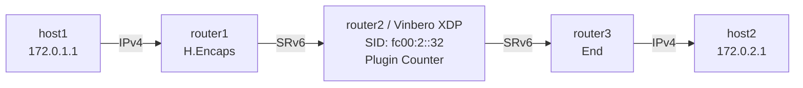

# Plugin Example: Packet Counter

Vinberoのプラグイン拡張機能のデモです。カスタムBPFプログラムをコンパイルし、CLIからtail callスロットに登録して動的に機能を追加します。

## 概要

このexampleでは:
1. パケットカウンタプラグイン (`plugin_counter.c`) をclangでコンパイル
2. `vinbero plugin register` CLIでVinberoに動的登録
3. SIDエントリのactionをプラグインスロット(32)に設定
4. そのSID宛のパケットがプラグインにディスパッチされることを検証

## トポロジー



**パケットの流れ:**
1. host1がpingを送信
2. router1がLinux native H.Encapsでカプセル化 (Segment List: [fc00:2::32, fc00:3::3])
3. **router2 (Vinbero XDP)** がfc00:2::32でプラグインにtail call:
   - `plugin_counter`: パケットをカウントしてXDP_PASS
4. カーネルスタックが残りのSRv6処理を継続

## プラグインの実装

```c
// plugin_counter.c (抜粋)
SEC("xdp")
int plugin_counter(struct xdp_md *ctx)
{
    // tail callコンテキストを読み取り
    struct tailcall_ctx *tctx = tailcall_ctx_read();

    // l3_offsetのバウンドチェック (BPF verifier必須)
    __u16 l3_off = tctx->l3_offset;
    if (l3_off > 22) return tailcall_epilogue(ctx, XDP_DROP);

    // カスタムper-CPUマップでカウント
    __u32 key = 0;
    __u64 *counter = bpf_map_lookup_elem(&plugin_counter_map, &key);
    if (counter) __sync_fetch_and_add(counter, 1);

    // エピローグ経由で返却 (統計 + xdpcap)
    return tailcall_epilogue(ctx, XDP_PASS);
}
```

## クイックスタート

```bash
sudo ./setup.sh    # 環境構築
sudo ./test.sh     # プラグインコンパイル → 登録 → テスト
sudo ./teardown.sh # クリーンアップ
```

## 手動実行

### 1. プラグインのコンパイル

```bash
clang -O2 -g -Wall -target bpf \
  -I ../../src \
  -I /usr/include/x86_64-linux-gnu \
  -c plugin_counter.c -o /tmp/plugin_counter.o
```

### 2. Vinbero起動とプラグイン登録

```bash
# Vinbero起動
sudo ip netns exec plgcnt-router2 ../../out/bin/vinberod -c vinbero_config.yaml &

# プラグインをスロット32に登録
sudo ip netns exec plgcnt-router2 ../../out/bin/vinbero -s http://127.0.0.1:8082 \
  plugin register --type endpoint --index 32 --prog /tmp/plugin_counter.o --section plugin_counter

# SIDをプラグインに向ける
sudo ip netns exec plgcnt-router2 ../../out/bin/vinbero -s http://127.0.0.1:8082 \
  sid create --trigger-prefix fc00:2::32/128 --action END_BPF
```

### 3. テスト

```bash
sudo ip netns exec plgcnt-host1 ping6 -c 3 fc00:3::100
```

## プラグイン開発について

独自プラグインの開発方法は [Plugin SDK ドキュメント](../../docs/dev/plugin-sdk.md) を参照してください。

### プラグインスロット範囲

| PROG_ARRAY | 組み込み | プラグイン |
|---|---|---|
| `sid_endpoint_progs` | 0-21 | **32-63** |
| `headend_v4_progs` | 0-7 | **16-31** |
| `headend_v6_progs` | 0-7 | **16-31** |
